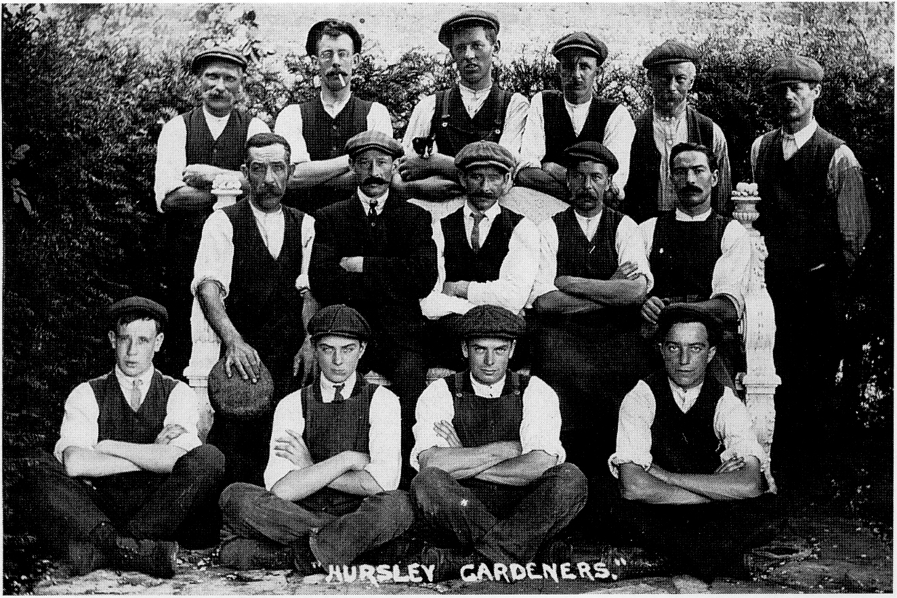

# Hursley Park's Grounds and Gardens

For centuries, English parks and gardens in
both landscaped and formal forms have been
the admiration and envy of many foreign
visitors. The overall aesthetic appeal owes
much to England’s temperate climate but,
surprisingly, despite this moderate climate
and good annual rainfall, many trees and
shrubs from such harsh environments as the
north of North America or Russia’s Siberia do
not survive. This is due to the unpredictable
changes in the weather that can occur
throughout the year.

*Conjectured appearance of Great Lodge, by Peter Mumford, 1983.*

Compared with other parts of the world,
Great Britain does not have four clearly
divided seasons. In other countries, when
winter ends, spring proceeds with no real
interruptions through to summer, on to
autumn, and back again to winter. In Great
Britain, the Gulf Stream can bring very warm
periods into January’s ice and snow, which
can happen several times during a winter
period. Even in summer, winter temperatures
can cut in with ground frosts at night. All this
plays havoc with imported plants, especially
those from harsh climates, whose genetic
make up causes them to trigger into new life
with warm days in winter, unable to stop or
retract when temperatures plummet again.
Should such a plant survive one reversal of
temperatures, the next can invariably be ‘the
last straw’. It is in part due to the ways the
English flora has adapted and performs so
magnificently in spite of this often overlooked
handicap, that admiration and respect is
deserved.

Historically, man has been working this land
for well over two thousand years since the old
Manor of Merdon on the Merdon Castle site,
for both arable and stock farming. It is from
this land south of the Castle that Hursley
takes its name (see first chapter). Gardens
have existed on this site from around 1560,
belonging to the Tudor lodge of 1553, whose
footings still show up in dry summers on the
bowling green to the south of the present
house. The Lodge had an enclosed square
walled garden of approximately one acre on
the south side, but to date no information on
the layout, contents or appearance have been
found. The illustration on the opposite page is
taken from an ink and watercolour painting
of the lodge of the 15th century, which is a
fair conjectured impression of the overall
appearance of this house viewed from the
north east. Walls built of brick for walled-in
gardens were found to be best, having in
particular one great advantage over other
walling materials, besides being effective in
keeping out animals (in Hursley’s case deer)
and shelter from winds, the wall was an
effective night storage heater for fruit trees
and bushes growing against it. The warmth of
the Sun on a south facing wall is held over
well into the night to such an effect that the
temperature of sheltered still air by such a
wall can average five degrees Celsius above
the open air temperature in the rest of the
garden. Even a one degree advantage could be
enough to protect blossom from frost damage.

To get an understanding and perspective of
the gardens at Hursley Park, the geology and
history of the site needs to be taken into
account. The Park House stands some 800
feet (250 m) to the north of a major geological
divide. The chalk strata that is under the
House abruptly disappears deep underground
under a ridge beyond the southern end of the
south lawn, and only surfaces again on the
other side of the Solent 0n the Isle of Wight.
The surface evidence of this dramatic change
in sub soils is seen in the plants of the hedge
rows and in the Rhododendrons which do not
like chalk soils, that are found to the south of
this ridge in the park and at Ampfield, but are
generally not evident on the chalk loam to the
north. The heavy clay subsoil below this ridge,
where the Sports Field is, underlines this
dramatic change. On the higher ground at
Ampfield the soil is Bagshot sand over clay.

*Walled Garden*

When the centre portion of the present
Hursley House was built around 1721, some of
the current features of the layout of the
grounds were laid down, which have been
maintained and enhanced right through to
present times. As with the old Tudor Lodge
the new house had a walled garden, but this
time it was rectangular, enclosing some three
acres, and was sited off the south east corner
of the House. Within this enclosure in the
early part of the twentieth century were
formal gardens of flower beds and
shrubberies divided by grass walks. A tennis
court was added around 1910. The kitchen
garden was outside the southern end of the
walled garden, out of sight of the principal
rooms in the House, and was able to take
advantage of the south side wall. The garden
wall was some 10 feet (3 m) high and, aided
by falling ground to the south, was also
sufficient to screen from the House green
houses, sheds and the head gardener’s flat-
roofed bungalow. The drive that went down to
the church and village from the House was a
turfed ride within an avenue of walnut trees,
of which only one or two now survive, and the
line of this avenue is now lost.

In the late summer of 1856, the American
lawyer and author Richard Henry Dana was a
guest at Hursley Park, and he wrote of his ‘
visit‘. . . laying down on the soft turf, under a
spreading and deep leafed oak tree, there are
no mosquitoes, or other plaguing insects as at
home, but one may lie at ease, on turf as
smooth and soft as carpet, undisturbed to
contemplate and enjoy this mixture of
wildness and cultivation that marks an
English Park. Here is nice attention to turf
and trees while by your side are deer, and
overhead are the circling and cawing
innumerable crows and choughs . . . The
Church and the village of Hursley is at the
Park gate, only about ten minutes walk from
the House, and this walk is over smooth turf
under the deep shade of trees . . . ’ (the
walnut avenue).

*The walnut avenue*

In 1902, the magazine ‘Country Life’ featured
Hursley Park House and grounds as they
were for most of the nineteenth century,
showing many of the Park’s views and the
walled garden. The photo on, page 42 shows
one of the views taken then, but not used in
the article. It is the principal aspect viewed
from the south west, with a dovecote in the
foreground.

When the House was extensively remodelled
in 1902—1903, the existing layout of the
grounds was retained and greatly enhanced.
The Japanese sunken garden with an avenue
of fruit trees continuing south, featuring an
ornamental lead water tank at its centre, was
constructed before the First World War, and a
spectacular rock garden, backed up with banks
of rhododendrons, was created in the area of the
present rifle range. The garden plan shows the
layout of the gardens at that time, which has
influenced the development of this site and the
maintenance of existing views ever since. A lot
of these features can still be seen in spite of the
many changes that have taken place, even
down to the course of many of the paths. Prior
to the First World War some fifteen gardeners
were employed creating and maintaining these
grounds to very high standards, so that every
aspect always pleased the eye.

The period of 1902 to 1940 was the swan song
of Hursley Park as a private residence, and
was captured in 1910 by Sir Phillip Burne-
Jones’s delightful painting of the Japanese
sunken garden. Another Burne—J ones
painting (not shown) depicts the herring bone
brick path that went from the walled garden
across the south side of the House, with lovely
flowering borders in the foreground. In 1909,
‘Country Life’ visited Hursley Park again and
the photographs from this halcyon period
Show that some things, happily, have not
changed too much.

In 1925, the landscape architect Gertrude
Jekyll (who worked with the famous architect
Sir Edwin Lutyens) was asked for her help in
enhancing the contents of the formal Hursley
gardens. She supplied lists of flowers with
drawings based on a rather large drawing
sent by the estate carpenter. She was also
asked for suggestions about the gardens at
Merdone Manor, but this time to rather
smaller drawings. It appears that the lady
was never able to Visit Hursley'to see her
proposals put into practice.

On leaving Hursley for Winchester, the road
between Standon Farm and Pitt enjoys a
particularly beautiful backdrop of variegated
trees on the hill, beyond the field on the south
side. This beautiful wood is the result of having
a ‘tree bank’ for Hursley Park, as a back up,
should any of the Park’s trees become diseased
or not survive. This legacy from the early part
of this century is serenely picturesque during
the autumn, and justifies the adjacent lay—by
for motorists to enjoy this panoramic View of
unusually colourful foliage.

*Japanese garden by Philip Burma-Jones*

*Hursley Park House Gardens (c. 1909)*

Within the formal part of Hursley Park, the
twenty years of neglect brought about by the
Second World War and period of uncertainty
over the future role of the Park House prior to
IBM’s occupation have now been redressed,
and the ravages of Dutch elm disease have
been overcome with replacement trees. The
removal of the war time experimental hangars
and ancillary buildings from the Southampton
Lodge area in 1989 has allowed the Park to
revert to its former state there. Preservation
of the mature trees has been the first priority
and considerable planting of new trees is
restoring the appearance and balance of this
English park scene.

As the development of this laboratory site has
matured, beds of shrubs and flowers have
been created around the new buildings, which
deserve more interest than just a casual
awareness of their existence. The object of
this chapter is to stimulate interest, which
will in turn be an encouragement to those who
create and maintain this attractive corner of
Hampshire.

Generally, IBM’s one hundred acres have
maintained the landscaped park tradition
with many interesting trees, shrubs and views
around the laboratory complex. The one
formal garden that has been able to be
retained and restored is the Japanese sunken
garden, which is now close to its original
appearance in the Edwardian heyday of this
country house around 1910.

Complete with Koi carp in the pond, and
plants that will delight the eye at any time of
the year, it’s an ideal spot in which to sit
and reflect upon the long and varied history of
Hursley Park, where some things have changed
beyond all recognition, while others have been
restored to their former glory. A few landmarks,
we hope, will never change and will continue to
be historical sign posts for future generations.

*Hursley Park gardeners c. 1910. Photo: S Thorne.*
