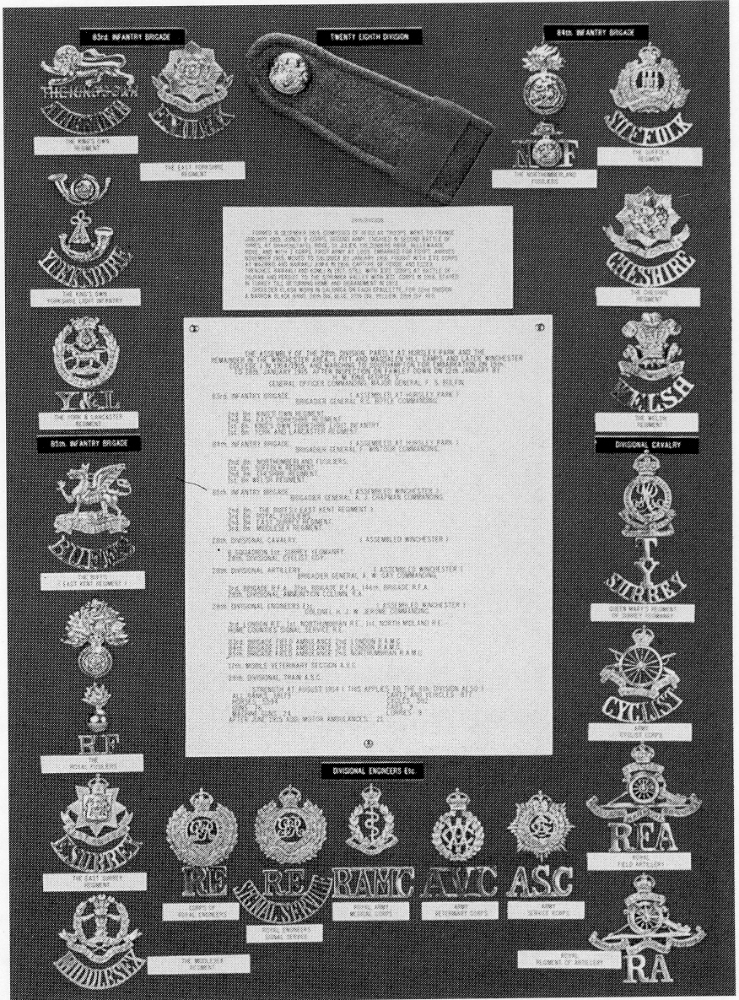

## The 28th Division

Although there is no tablet to record the
partial assembly in Hursley Park of the 28th
Division in December 1914 and January 1915,
this Division did assemble and mobilise at
Hursley, Pitt Hill, and Magdalen Hill Camps

*28th Division cap and shoulder badges*

 

**TBC...**