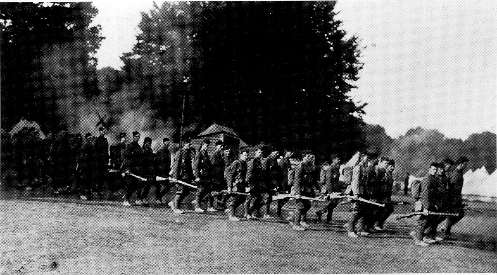
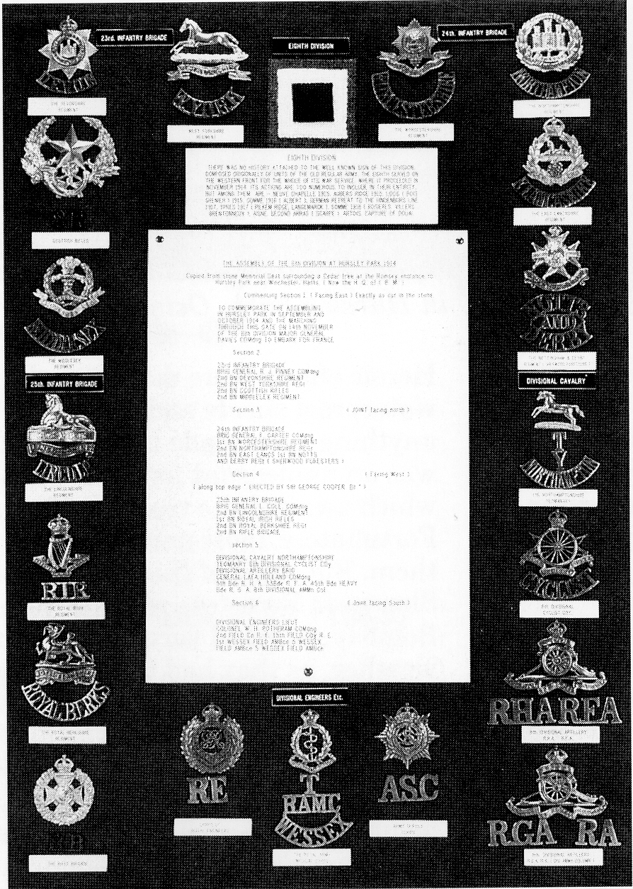
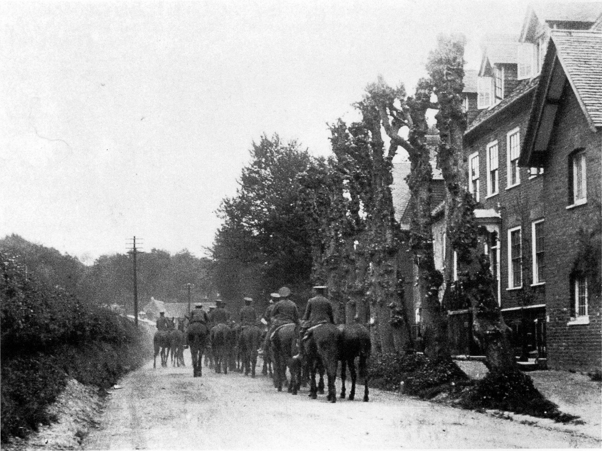
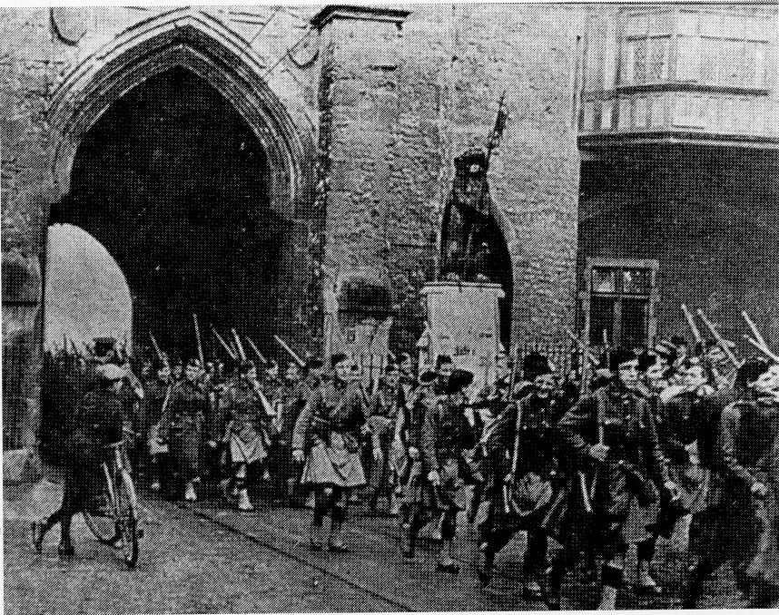

## The 8th Division

The urgency of the need for the 8th Division
was highlighted by the disastrous events that
had overtaken the 7th Division in France with
a casualty rate of nearly 80 percent. The 8th
Division had not existed before the war, and
was the second of the improvised formations
added to the original British Expeditionary
Force. It was composed of troops drawn from
overseas garrisons, and consisted of infantry,
artillery, and service groups. The composition
of these three groups is shown in the diagram.

---

INFANTRY ARTILLERY
MOUNTED
TROOPS
BRIGADES BATTALIONS BRIGADES EfllfifiDE HEAVY ARTILLERY
2nd Devonshire 1st Northants COLUMN
2nd West Yorks’ Yeomanry fl
23rd 2nd Scots Rifles
(Cameronians) 51h RHA 5th Royal 81h
2nd Middlesex i 8th Cyclist Horse
lst Worcestershire Company Amllery
2nd East Lancashire
24th 151 Notts and Derby 33rd RFA 33rd 118th
(Sherwood Foresters) MOBILE
2nd Northamptonshlre VETERINARY
2nd Lincolnshire SECTION 45th RFA 45”] 119th
2nd Royal Berskshire
25th 1st Royal Irish Rifles 15m Heavy Battery
2nd Rille Brigade Ammn. Columns
DIVISIONAL FIELD DIVISIONAL DIVISIONAL FIELD
AMMN. COMPAN Y SIGNAL TRANSPORT & AMBULANCES 35A;
COLUMN (ENGINEERS) COMPANY COMPANIES Fieild Artillery
2nd 4151 24th (lst Wessex) _
81h 8th 84th 25m (2nd Wessex) 22
15th 22m 26th (3rd Wessex) Horse Artillery

---

*Composition of the 8th Division November 1914*

The twelve infantry battalions were all
brought back from overseas stations. One
each came from Aden, Bermuda and South
Africa, and three each from Egypt, India and
Malta. The climatic changes that these moves
entailed certainly affected the initial potential
of the 8th Division. The mounted troops
included an existing yeomanry regiment, and
a cyclist company that was formed on
mobilisation. The field artillery was made up
of one horse artillery brigade (three batteries),
the heavy batteries were new units formed at
Woolwich, and the field companies came from
Cairo in Egypt and Gibraltar.

The 8th Division started to assemble on
Baddesley Common but on 2nd October 1914 the
Divisional Headquarters and available units
moved to Hursley Park, where concentration
was effected. The first units to arrive came from
Malta, and the arrival of the 2nd East
Lancashire Regiment on 30 October 1914
completed the Division, making a total of
approximately 12,000 men. All these were
accommodated under canvas on the pasture land
between Merdon Castle and Hursley House,
which must have been a spectacular sight.

Because the surrounding countryside was
alive with game, a few well thrown stones or
‘accidental’ rifle shots caused many game
birds, rabbits and hares to find their way into
the army’s cooking pots. For the first three
weeks in the Park the Division had fine
weather in which to organise itself, but
towards the end of October the fine weather
broke and the camp became a sea of mud.

*2nd Scottish Rifles returning from a field day in Hursley Park, October 1914*

Heroic efforts were made to ladle the mud into
waterproof sheets and remove it, but this, if
anything, only made matters worse. The mud
was an unpleasant foretaste of the conditions
which awaited the troops in France.
Fortunately, most units had their kit with
them. But some of the troops, like the
Sherwood Foresters who had just come from
Bombay, suffered very much from the
weather, as they had to live in their foreign
service khaki drill for over three weeks, no
service dress being readily available.
November 1914 was in 1994 the wettest this
century by almost 20 percent. As already
mentioned, the acclimatisation necessary for
the overseas troops caused marching qualities
to fall below those of a home service battalion.

During the 8th Division’s stay in Hursley
Park they had two notable visitors, Sir Henry
Rawlinson and Lord Kitchener. Sir Henry
Rawlinson came over from France and
lectured the whole Division on the troubles
that had overtaken the 7th Division. That
Division had landed at Zeebrugge and
Oostende, and had suffered severely before it
joined up with the remainder of the British
Army around Ypres. (Out of 400 officers, 840
had become casualties.) Although the troops
had gone to the lecture feeling cheerful, they
came away feeling as if they had had a good
thrashing, and that they apparently had no
chance of success over the Germans. Whether
this sombre address and its associated
depression was the reason for one suicide is a
matter of conjecture, but many months after
the 8th Division had left Hursley, an Army
uniformed corpse was found hanging in
Brooks Copse behind Ladwell.
 

*8th Division cap and shoulder badges*

Lord Kitchener, the Secretary of State for
War, and previously an officer in the Royal
Engineers, came and inspected the three
companies of Royal Engineers, and almost
certainly inspected the whole Division.

In addition to lectures and inspections, the
Division practised in artillery and infantry
formations with all services in attendance,
punctuated by trench digging and rifle
practice with the new Lee—Enfield short
service rifle. Nearly all the officers and men
were given a welcome two days leave.

*Soldiers on horseback in Hursley village*

As a Division, the 8th had some major
shortcomings. For artillery it had an
‘unallotted’ brigade of Royal Horse Artillery,
and two companies of Royal Field Artillery. It
had no field howitzers and no 60-pounders, a
deficiency rather inadequately compensated
for by two heavy batteries hastily formed at
Woolwich and armed with antiquated 4.7-inch
guns. Its engineers came from Egypt (2nd
Field Company) and Gibraltar (15th Field
Company) but its Signal and Cyclist
Companies and most of its other divisional
units had to be improvised. The division
therefore lacked the cohesion that the original
six divisions had acquired from working
together in peace time. The Divisional
Commander, Major-General Francis Davies,
came from the War Office, and neither he nor
his brigadiers knew the troops placed under
their command. The 2nd Devons had expected
to be allotted to the same brigade as the other
two battalions from Egypt, and were
particularly sorry not to be with the 1st
Worcestershires with whom they were on the
friendliest terms. There was a fair amount of
disappointment over many of the placings, but
discipline and work was such that there was
little time to consider what might have been.
On 5 November at noon the 8th Division
marched out of the mud 0f Hursley Park in
torrents of rain for Southampton Docks. The
column’s length was such that when the head
of the column reached the Docks, there were
still troops getting into marching formation in
Hursley Park. Through the streets of
Southampton the long column was watched
and cheered by large crowds. The column’s 
length was added to by numerous wagons of
two, four and six wheels, guns pulled by
horses, and a certain amount of mechanical
transport from the Service Corps. Steam and
petrol-engined lorries, some with trailers,
moved a vast amount of equipment.

*Sottsh Rflies assing through Bar Gate,
Southampton, November 1914*

Generally the 8th Division’s stay in Hursley
Park had been very uncomfortable in the rain
and mud. Special Reservists, sent to bring the
2nd Battalion East Lancashire Regiment up to
war requirements, had been somewhat
troublesome, so few were sorry to say good-bye
to Hursley Camp.

The 8th Division served on the Western Front
for the whole of its war service. Its actions are
too numerous to include in their entirety, but
among them are Neuve Chapelle, Aubers Ridge
and Loos (Bois Grenier) in 1915. In 1916 they
were at the Somme (Albert), and in 1917 they
saw the Germans retreat to the Hindenburg 
Line, and fought them at Ypres (Pilkem Ridge
and Langemarck). Leading up to the end of the
war in 1918, they were at the Somme (Rosieres,
Villers and Brentonneux), Aisne, Second Arras
(Scarpe), and at Artois the capture of Douai.