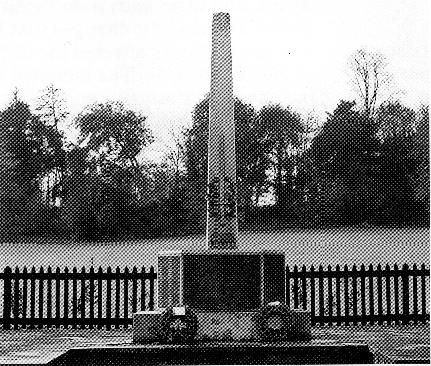
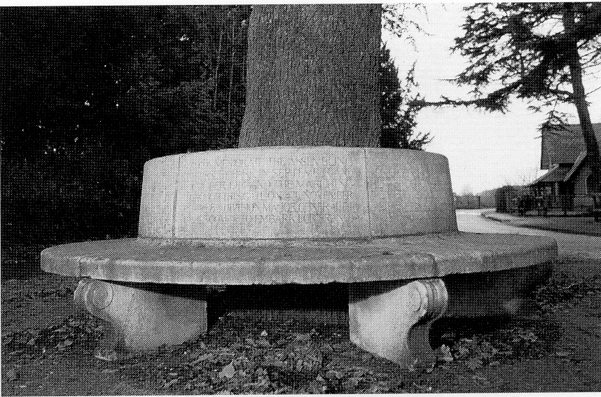

# Hursley Park during the Great War 1914 - 1918

As in most English villages, the only evidence
today of the intrusion of the First World War
into Hursley’s life is the war memorial sited
on the edge of the village green, by the road.
Some events relating to this period are
remembered by a memorial tablet or edifice,
while others are, strangely, forgotten, despite
their real importance at the time. Hursley had
events that fall into both categories. At the
entrance to the Park by Southampton Lodge,
close by the Keble Memorial School, there is a
circular stone seat around a yew tree that
records the assembly of the 8th Division here
in 1914, but no record exists of the 28th
Division that partially assembled a month
later. Also the American Field Hospital which
stood in the field below Merdon Castle at
Standon Farm is almost forgotten, as is Lady
Cooper’s Hospital which was housed in
Hursley House itself. Most extraordinary of
all is that all evidence of Hursley Park
Aerodrome, used by the Royal Flying Corps
which became the Royal Air Force at the end
of the war, has completely vanished, and its
only evidence is in archived papers.

*Hursley war memorial*

The circular stone seat by Southampton
Lodge is made up of six segments, and the
back rests double as tablets recording the
formation and order of battle of the 8th
Division. The other five tablets are a register
of the companies, regiments, brigades and
commanding officers who made up the 8th
Division, which must have been the biggest
and most spectacular event of the war in
Hursley, especially when they marched off
towards Southampton Docks.

The legend on the principal table reads as
follows:

> ERECTED BY SIR GEORGE COOPER BT. TO
> COMMEMORATE THE ASSEMBLING IN HURSLEY
> PARK IN SEPTEMBER AND OCTOBER 1914 AND
> THE MARCHING THROUGH THIS GATE ON 4TH
> NOVEMBER OF THE 8TH DIVISION
> MAJOR GENERAL F.J. DAVIES COMdng,
>
> TO EMBARK FOR FRANCE

*Memorial to the 8th Division 1914*