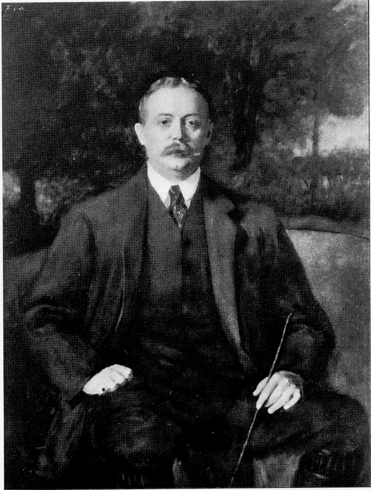

## Sir George Cooper Bt

Of all those blessed with wealth at this time,
Sir George Cooper’s philanthropy to his
country made him stand out from the rest, not
only because of what has already been
mentioned, but principally because of his
donation to the war effort amounting to
approximately five million pounds, the largest
private donation of the war. The depletion of
the family fortune by this donation and later
swingeing death duties contributed to the
family finding Hursley House too costly to
renovate for use as a private residence after
the Second World War.

There can be few equals to Sir George
Cooper’s commitment of his private resources,
given that in every way possible he helped the
country’s war effort during this and later
troubled times.

*Sir George Cooper, Baronet.*
