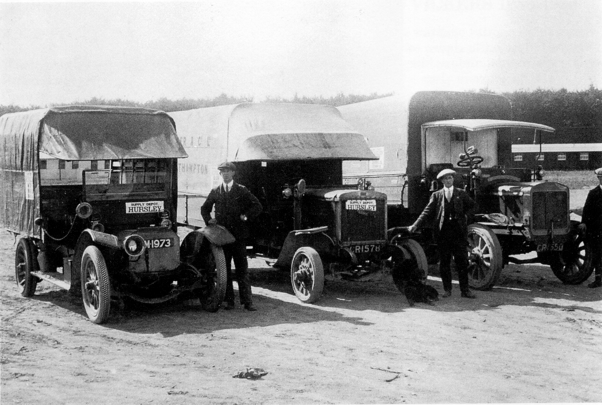

## Hursley Aerodrome

Evidence of the existence in Hursley Park of
part of the Worthy Down Royal Flying Corps
has come from research at Worthy Down.
From these limited references it seems that
the Hursley Park section was a satellite
aerodrome of Worthy Down, probably set on
the high ground above the hamlet of Pitt, on
the Winchester side of the Park. It seems that
advantage was taken of the entertainment
hall at the Park House for lecturing purposes,
and the Park for airfield and observation
tuition. It is unlikely that the flat meadows
south and west of the Southampton Lodge
would have been used as an aerodrome, being
too close to the House. There is a grave in
Hursley churchyard of two members of the
Royal Australian Flying Corps, who both died
on 12 May 1918, in what could have been a
local flying accident. Was there an Australian
Squadron here?

*Three of the vehicles serving the Hursley supply depot. Photo: S Thorne.*

On 1 April 1918, the Royal Air Force came
into being, and inherited nearly two hundred
and fifty airfields and landing sites
throughout the United Kingdom from the old
Royal Flying Corps. By 1924 this number had
been drastically reduced to just twenty-seven,
and Hursley Park Aerodrome was one of many
to be relegated to history and obscurity,
leaving no evidence of its existence except
some references to the Royal Flying Corps at
Hursley in various record offices. There is
always the hope that a photograph will
surface some day.