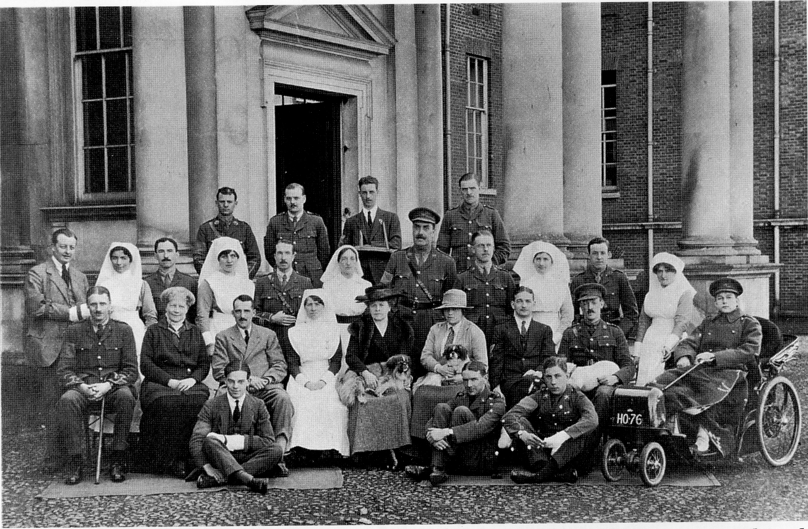
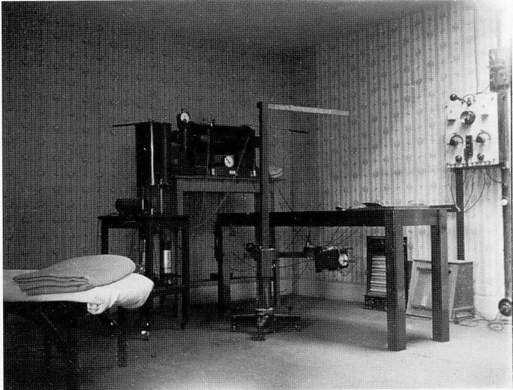
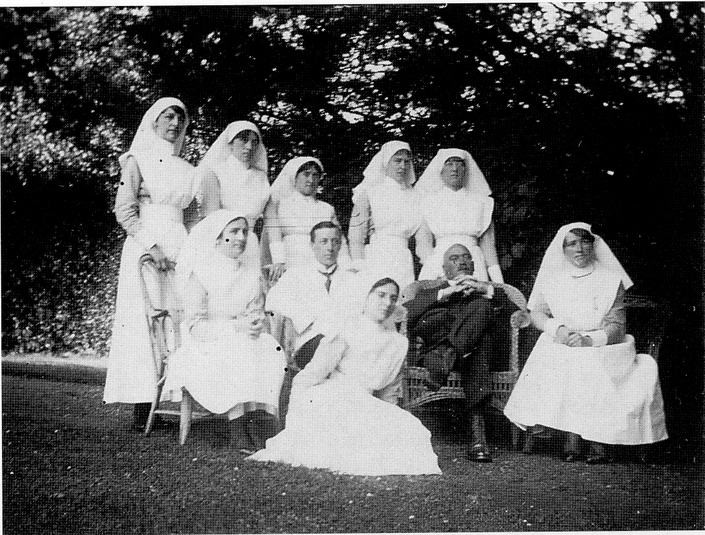

## Lady Cooper’s Own Hospital

Functioning at the same time as the US.
Hospital was Lady Cooper’s own Hospital/
Nursing Home for Officers. This used many
rooms on the first floor and most of the second
floor of Hursley House. The photograph on
the following page was taken outside the
main entrance of the House and shows some
of the staff and patients with the patron,
Lady Cooper seated in the centre, with her
daughter Mrs Wilkie on her left. Sister
Boughey who had the responsibility of matron
is on her right. The other seated lady is the
housekeeper, who could have stepped from
the cast of a television series on stately home
life. The nurse standing fourth from the left is
remembered as ‘Rust’. The two men in mufti
(military plain clothes) seated on the ground
to Lady Cooper’s left are thought to be George
and Alexander Cooper, her sons. George, later
Captain Sir George Cooper, was also a patient
in the hospital for a time. This photograph
came from Captain FVL Redman of the Royal
Artillery, who is seated in the electric Bath
chair, having had his right leg amputated
below the knee.

*Some of the staff and patients of Lady Cooper’s Hospital. Lady Cooper is seated in the
middle of the front row, to the right of Sister Boughey*

Lady Cooper gave her house and paid all the
expenses and salaries etc. for her wartime
hospital. The X-ray machine that Lady
Cooper bought for her hospital was the first
one in this area, and after the war it was
given to Winchester’s Royal County Hospital.
It is believed that about 40 patients could be
nursed at a time, but the total number of
patients who passed through this Hospital
has not come to light, nor the total staff who
served them. From another collection of
photographs (rescued from a dustbin) we can
identify seven more nurses and two doctors
(see photograph opposite). They are nurses
Smith, Miller, Telfer, Brazier, Aldridge;
Nurse Ramage, Dr Clarke, Nurse Rees,
Dr Goodwin and Sister Boughey.

*X-ray and electric room*

*The medical staff*