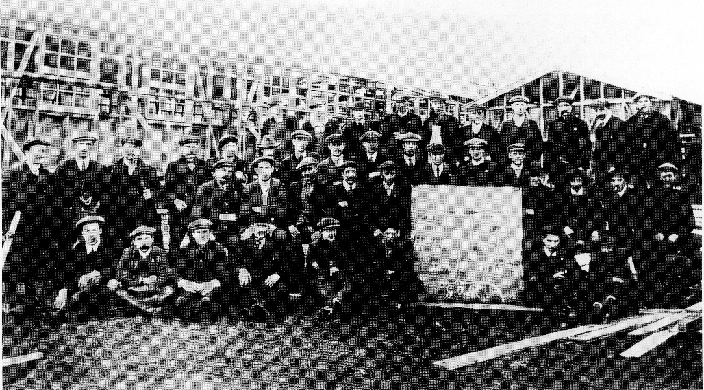
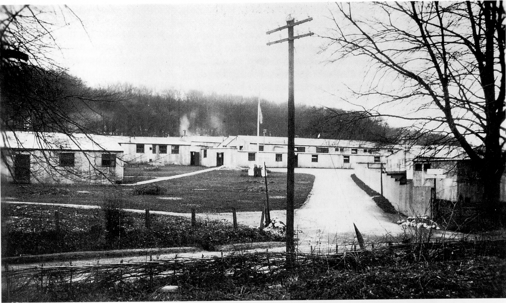

## The United States Military Hospital

*Men who assembled the wooden buildings of the US Military Hospital. Photo: S Thorne.*

The US. Military Hospital No 204 was
constructed in Hursley Park in the latter half
of 1917, in the field that lies to the south of
Standon Farm, and to the east of Merdon
Castle alongside the Romsey Road. The
hospital could hold about 450 patients in the
wooden wards, with considerable overflow
capacity in adjoining tentage to meet that
need. Little has come to light about the
hospital except for some old photographs, and
today there is no other evidence of it ever
existing. It was demolished by the end of
1918\. The siting of the hospital in Hursley
Park was probably influenced by the fact that
Lady Cooper was American by birth.

*Main entrance to the US. Military Hospital*