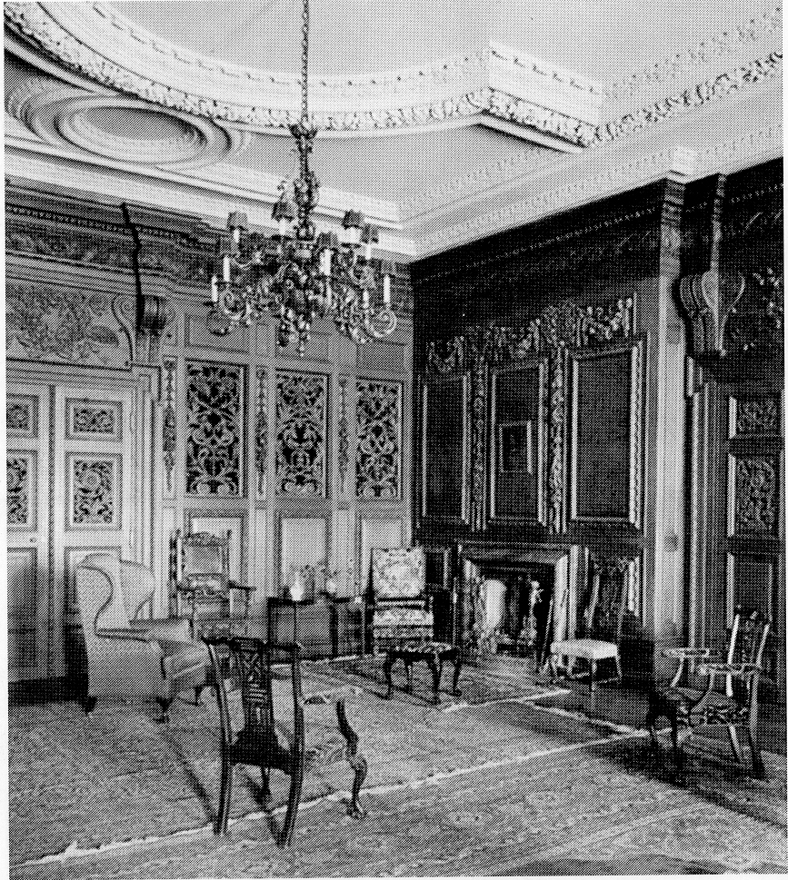
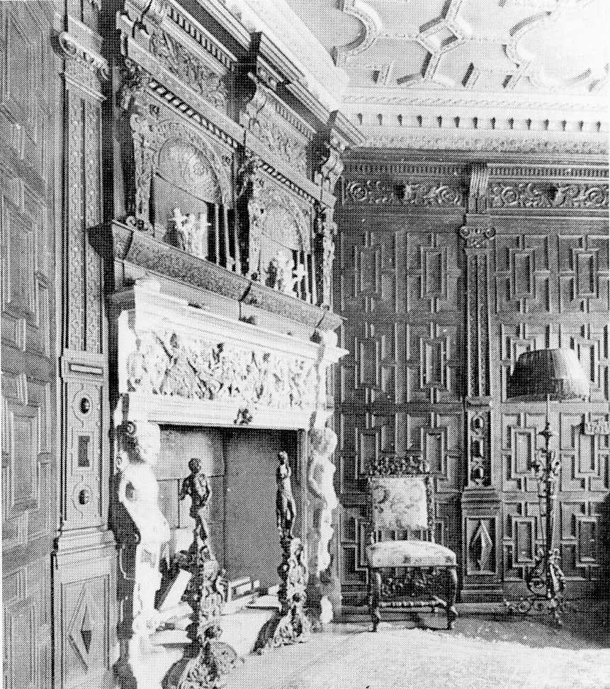
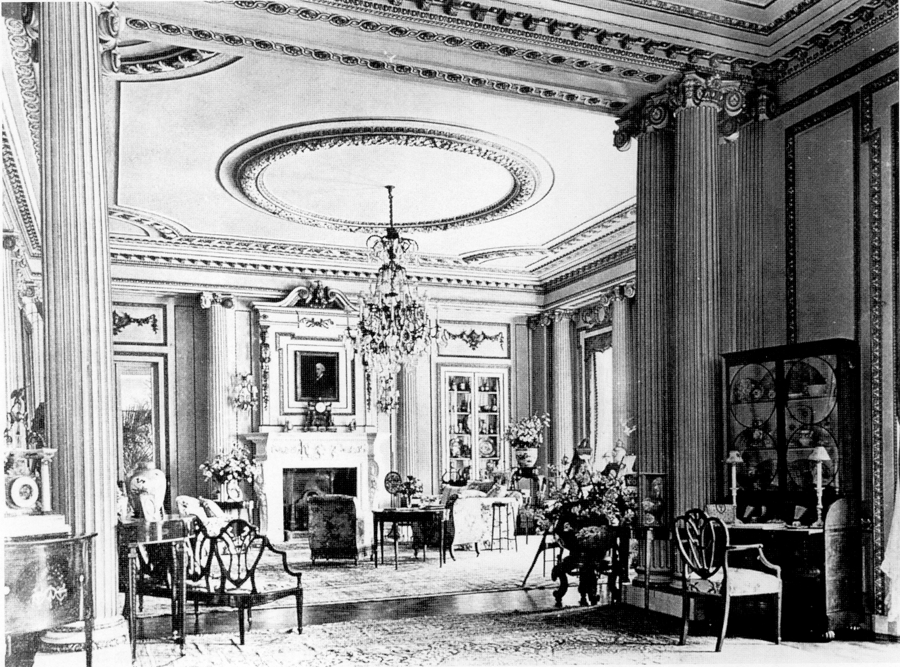

## A Show House

In the summer of 1903, the alterations to
Hursley Park House (though not yet finished)
were so far advanced that the Coopers were
able to move in earlier than planned. Just
before their return a magnificent celebration
dinner was held in the remodelled central
hall, under the new electric lighting, for about
70 site representatives and trades people. The
dinner was followed by entertainment of songs
to the piano, piano solos and piano-violin
duets, punctuated by speeches and recitations.
The rest of the work force was not forgotten:
every man received a money gift.

*North-east corner of main hall, 1909*

On completion of the alterations, Hursley
Park House was equipped with tapestries,
paintings, furniture and fabrics all of which
could be regarded as fine-art treasures today,
many being almost priceless. The tapestries
were from Beauvais, and there were paintings
by Hofner, Romney, Rayburn and Reynolds. An
impression of the elegance of the house and the
quality of the fabric and furnishings can be seen
in the accompanying photographs reproduced
from a 1909 edition of ‘Country Life’. The
photograph of the north end of the ballroom is
of some interest. Below the great Beauvais
tapestry is a musicians’ recess complete with
perimeter balustrade; the balustrade could be
removed to increase the floor area. Also, with
the piano removed, special decking could be
placed on this balustrade and ledge below the
tapestry to provide a stage for theatrical
entertainment, with the tapestry as a backdrop.
The floor plans (on pages 55 to 58) give the
room identifications.

*The Boudoir fireplace, 1909*

In June 1905, the King’s birthday honours list
included the name of G A Cooper Esq, of
Hursley Park. According to newspaper
cuttings of the day, Sir George and Lady
Cooper received a tremendous welcome home
with a handsome arch of evergreens and
bunting at the Winchester Lodge entrance. It
is said that 300 to 400 people assembled there
with some 200 estate employees waiting
inside to greet the new baronet.

*Drawing room, 1909*