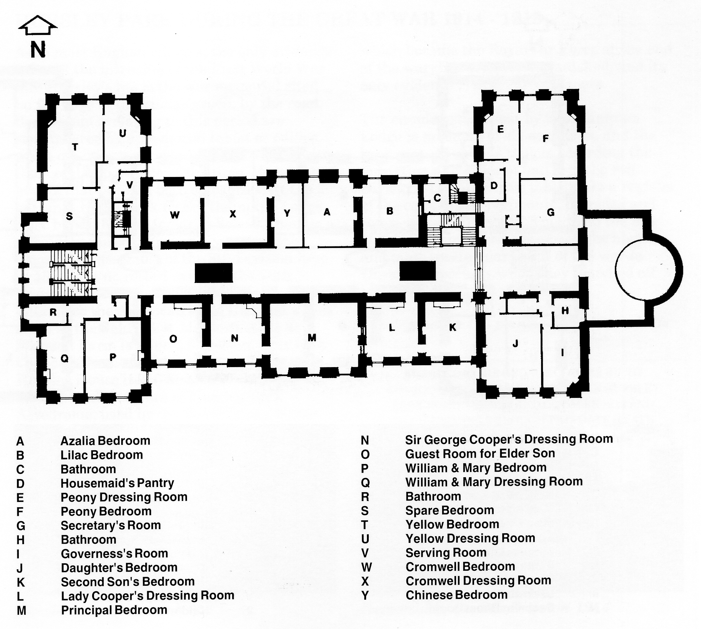

## The Social Order

*The Beauvais tapestry, north end of ballroom, 1909*

Of the social events in Hursley Park House,
the twenty-first birthday of Sir George
Cooper’s eldest son in 1911 was still
remembered in 1972 by some of the villagers;
it seems to have been a very notable occasion.

*West Hall*

Like the Heathcotes (and to a certain extent
Joseph Baxendale), the Coopers had much to do
with public works in Winchester - the judiciary,
hospital and local council for example - for
which they are still remembered.

Sir George Cooper’s public spirited response
to the needs of the First World War added
greatly to Hursley’s rich history, and is
covered in the chapter beginning on page 59.

After the First World War and up to the
Second, the House and Park fulfilled the
functions they had been designed for, namely
seasonal occupation according to the social
calendar. During this period the gardens were
extended and the house enhanced - including
a change to AC electric lighting in 1926. The
two original Crossley engines were harnessed
to new AC generators, and the o1d
accumulators were discarded.

The Coopers had their own vehicle colours,
which were used on most of their motor and
horse carriages. The colours were green for
the body flanks and black for wings
(mudguards) and wheels. During their 40
years at Hursley, the Coopers owned an
interesting variety of motor vehicles
including: Benz; Brush; Panhard et Levassor;
1906-7 Sunbeam; 1909 Rolls Royce 40/50;
Singer Super Six; Commer Coach (15 seats);
1933 Rolls Royce Phantom 11; Ford V8
shooting brake; Morris 21hp Six; Humber
Super Snipe; and a Wolseley 25hp Six. The
coach house usually held a ‘four in hand’ (a
carriage pulled by four horses with the driver
on a high box); a brougham (a one-horse short
closed four wheeler); a phaeton (a light open
four wheeler usually pulled by a pair of
horses); and a commission van for the carriage
of post and local purchases and for collections
at Winchester Railway Station.

*The Cromwell Bedroom*

With the outbreak of the Second World War in
1939, the amenities of the Park were
immediately offered for the use of the Services,
as well as the House for a hospital again. In
1940 Sir George Cooper died, and Lord
Beaverbrook requisitioned the House to rehouse
the design staff of Vickers Supermarine, who
had been bombed out of their premises at
Woolston, Southampton. This effectively
marked the end of the use of Hursley Park
House as a private residence. The war years
and those following are covered in a later
chapter.

*Lower Ground Floor Plan (1903)*

*Ground Floor Plan (1903)*

*First Floor Plan (1903)*

*Second Floor Plan (1903)*

