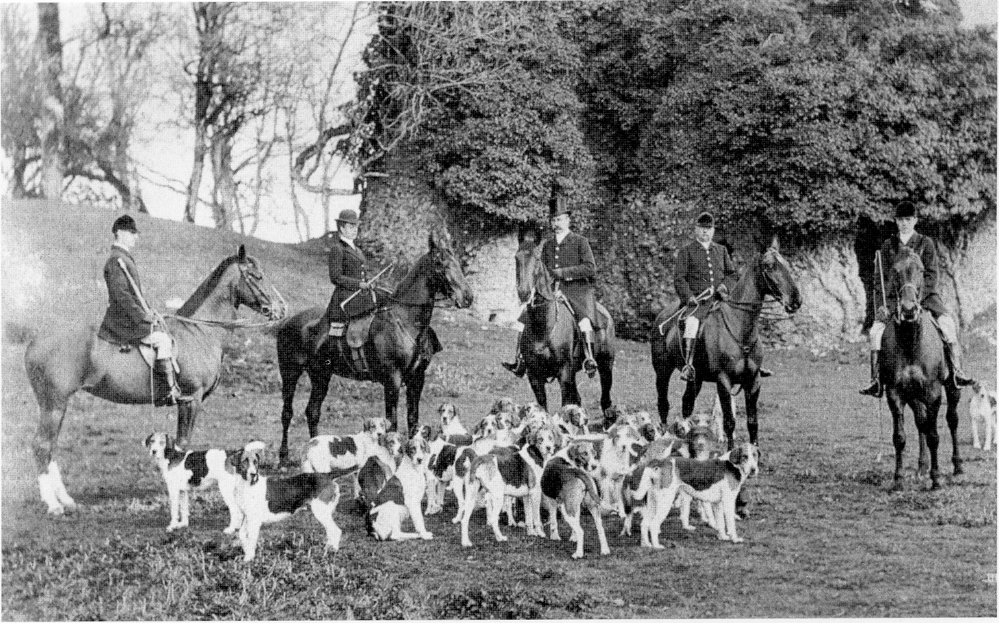

## A Change of Owners

Sir William Heathcote died in August 1881
after several years of ill health. In a deluge of
rain, a large congregation witnessed the
interment in the family mausoleum in
Hursley churchyard. In 1888, the Dowager
Lady Heathcote sold the whole estate at
Hursley to Joseph W Baxendale for £150,000.

At that time, Joseph Baxendale was senior
partner and principal proprietor of Pickfords
(Removal Contractors). Later, in 1901, when
Pickfords became a private limited company, he
became chairman and the largest shareholder.
He had a son and two daughters. In 1906 his
son J F Noel Baxendale married Margaret
Heathcote, a granddaughter of Sir William
Heathcote the fifth baronet. Joseph Baxendale
seems to have been a much respected man who,
during his time of residence, kept a full
complement of domestic and estate staff and
fulfilled all the public duties expected of him.
During his fourteen years of ownership, he
made no alterations to the house or grounds
except for the rebuilding of the stable. In 1902
he concluded the sale of the whole estate to
George A Cooper (later Sir George Cooper) for
£230,000. This sale was brought about due to
business problems at Pickfords and the financial
drain of investments in the Trans Siberian
Railway. Joseph Baxendale decided that he
could no longer maintain four estates, and
Hursley was the one to be sold.

*Hursley Hunt by Castle Tower (c. 1900).  
The gentleman in the top hat is Joseph Baxendale, the then owner of Hursley Park.*