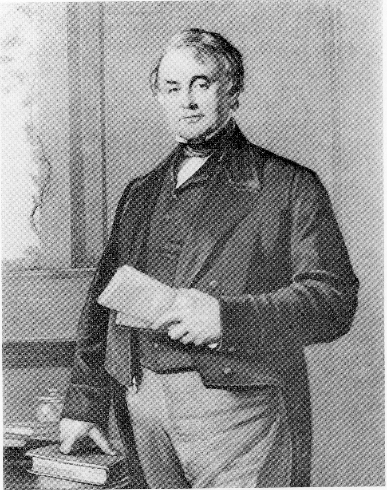
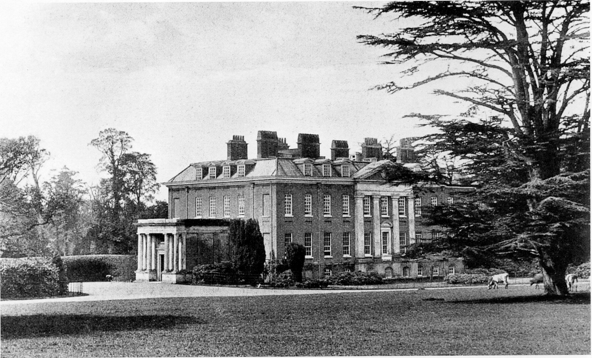
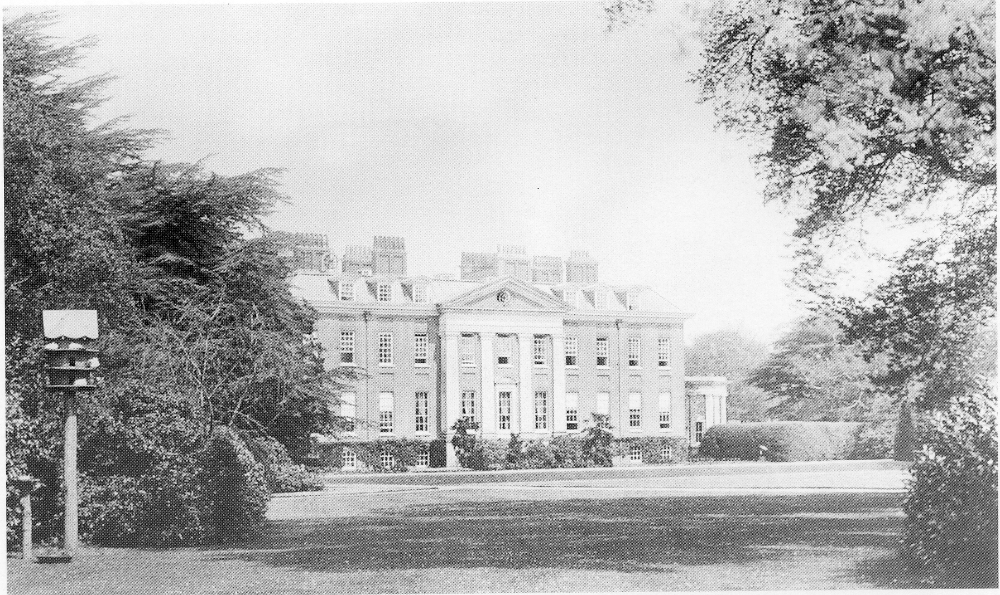

## The Fifth Baronet (1870)

Sir Thomas Freeman Heathcote died without
issue in 1825 and was succeeded by his nephew
the third Sir William, the fifth baronet of
Hursley, who was born in 1801. Sir William’s
father was the Reverend William Heathcote
‘Rector of Worting, Hampshire and Prebendary
of the Cathedral of Winchester’ who was the
second son of the second Sir William, the third
baronet. The third Sir William inherited many
characteristics of the second Sir William and
followed a very similar career. He gained a BA.
at Oriel College Oxford (where his tutor was the
Reverend John Keble) and in 1825 he started to
read law at the Temple. In the same year, he
inherited the property, estate, and duties of his
uncle. In the latter part of 1825 he married, and
in the following year he was elected member for
the county ‘on the Tory interest’. The following
years are recorded as being exceptionally happy
for him, coming to a tragic end in 1835 with the
death of Lady Heathcote, who left him three
sons and a daughter. At this time, Sir William
gave his old friend and tutor John Keble the
‘living’ at Hursley. During the next few years,

*Sir William Heathcote, Fifth Baronet, 1870*

Sir William’s mother lived at Hursley to look
after the children, relinquishing these duties in
1841 when Sir William re-married and started a
new era of happiness and public service. Having
earlier retired from Parliament for health
reasons, he entered Parliament again as MP for
Oxford University and became a privy
counsellor. In his public work he had much to do
with the building of Winchester prison and
hospital, and with the administration of justice
in Winchester. By his second wife he had four
sons and four daughters.

*Hursley House from the north-east, 1825 to 1902*

In 1829 Sir William Heathcote added new
coach houses, a clock tower and tack room to
the stable complex, closing a stable yard
formed by the stable wall, the stables and the
living quarters for the coachmen and grooms.
During the 1840s, the farm buildings at the
Merdon Castle site were demolished and a
new farm, the present Home Farm, was built.
The castle site was thus clear for the first time
in some three hundred years. The new Home
Farm was for many years a show farm, and a
point of interest for visitors to the estate.

*Hursley House from the south-west, 1825 to 1902*