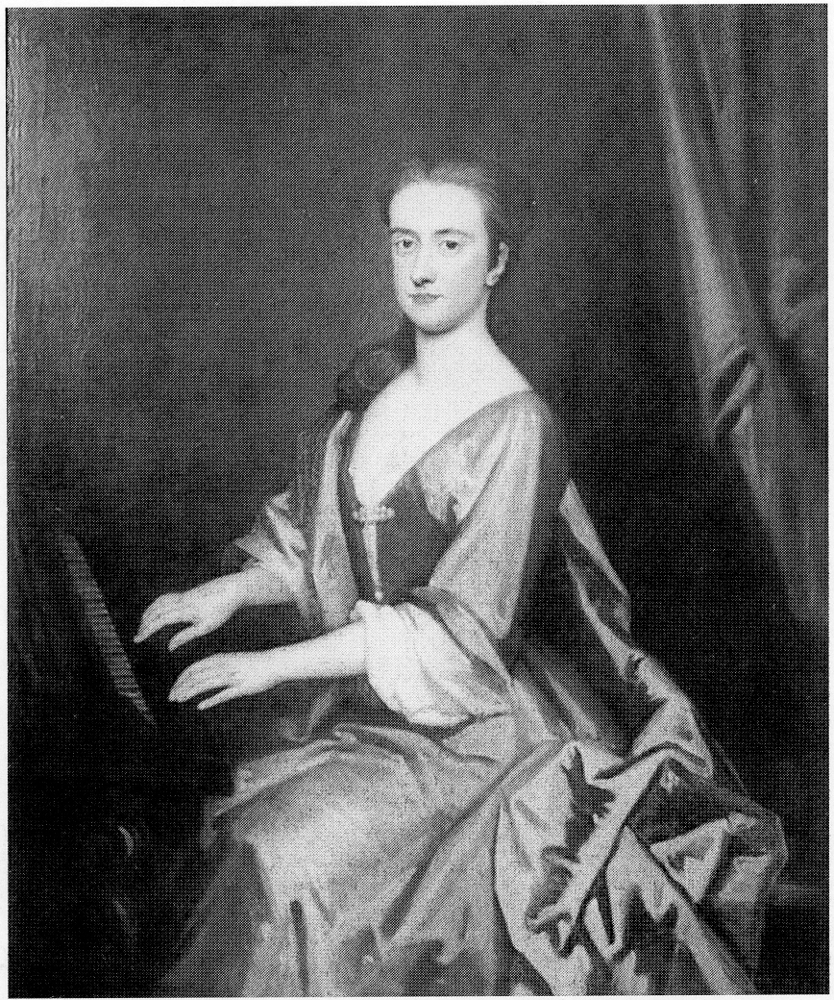
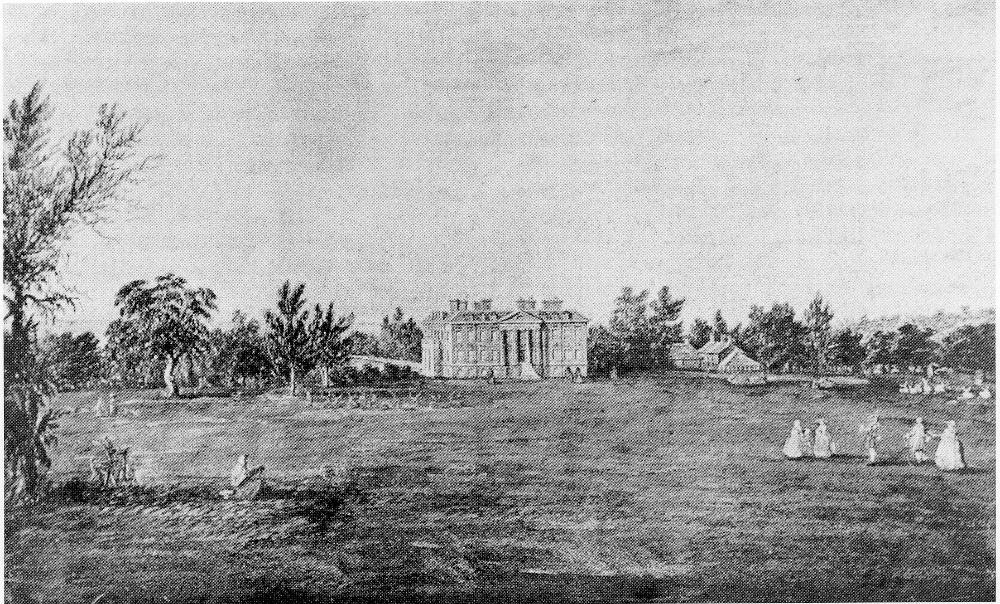
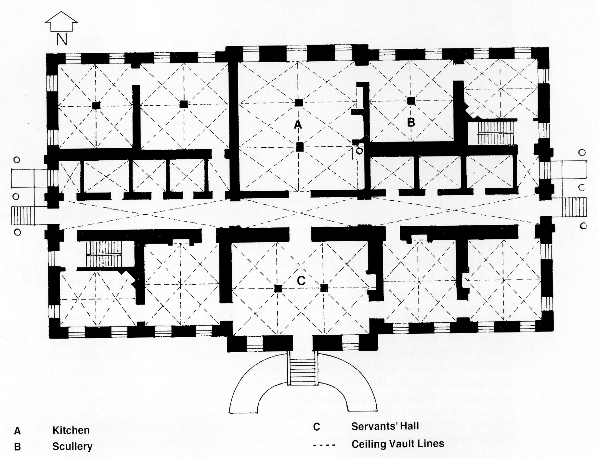
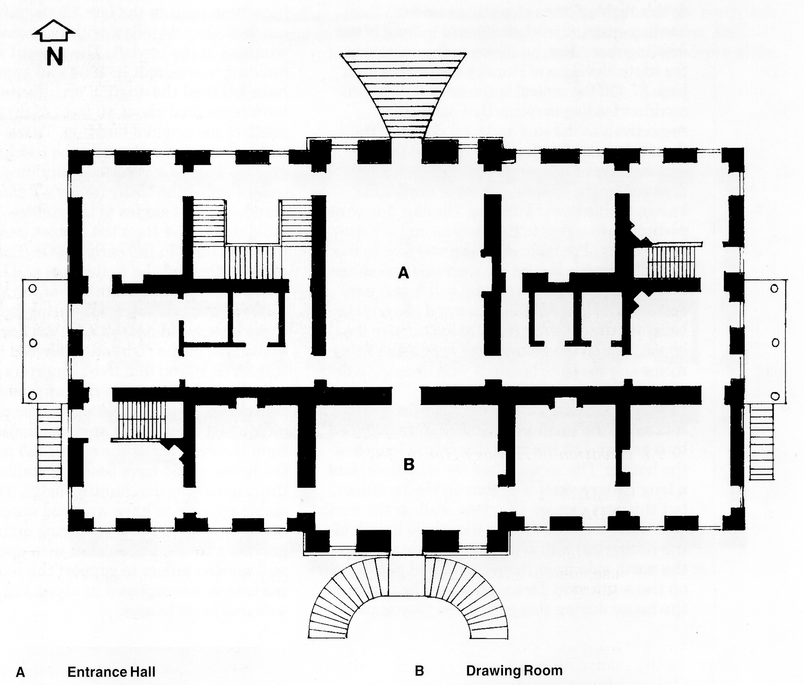
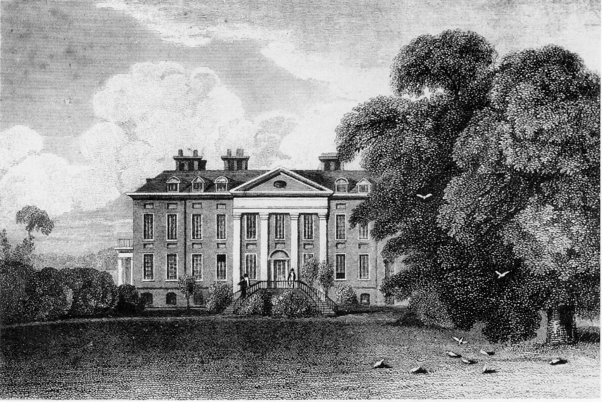

## Hursley Park House (1720 - 1821)

*Lady Betty Heathcote, wife of Sir William*

Since its erection, the house has at different
times been referred to as the Mansion House,
the Park House, and the Lodge. No regular
architect seems to have been employed, and
Sir William Heathcote made all the contracts
and supervised the building of Hursley Park
House between the years 1721 and 1724, with
assistance from an uncle and two friends.

One John Draper was clerk of the works and
he probably had some architectural
responsibilities. In an account book dated 30th
March 1730, Sir William Heathcote wrote:

> An acct: how much 1 have spent in building Hursley
> Lodge.
>
> The house besides all the old materials of the old > seat, which I compute save me above £3,000 £11,000
>
> A new Brew House,
> Laundry about £500
>
> My Garden - about £800
>
> All charges in bringing the water
> to the house £1,200
>
> New paleing in my park about £1,000
>
> New farm houses etc about £500
> £15,000

From opinions of the day and subsequent
comments, the original concept of a spacious
building of handsome proportions certainly
seems to have been achieved.

*Hursley House from the north, 1725*

This Hursley Park House forms the heart of
the present house: the two wings, porte-
cochere and conservatory were added in 1902-
1903. (A porte-cochere is a roofed structure
extending from the entrance of a building to
shelter from the weather those getting in and
out of vehicles.) Although built during the
reign of George I, the house is typical of the
period of Queen Anne (the previous monarch),
being severely straight in its lines both inside
and out. The house is built of red brick
quoined with stone; it has large framed sash
windows with small inset brick panels above
them and, when originally built, it had stone
porticos at the east and west ends featuring
three Doric columns in each. These porticos
complemented the other two porticos of four
huge Doric pilasters and pediments in the
centre of the north and south faces of the
house. The plan of the house was that of a
rectangle, 110 feet (34 m) long by 62 feet
(19 m) wide. Each floor had windows of
identical design, and on the north and south
faces they were on a common pitch of 10 feet
(3 In). On the east and west faces, the window
pattern was made regular with inset brick
panels to balance the appearance. The
windows, together with the building’s other
characteristics, gave the house a very
symmetrical form that was popular in the
eighteenth century. The accompanying floor
plans of the lower ground floor (basement)
and ground floor were copied from the
builder’s drawings in about 1735.
Unfortunately, the corresponding plans for
the first and second floors have not been
found. These plans show the layout that
lasted until about 1820.

The lower ground floor plan can be easily
traced today. The main east to west corridor
had a door at each end under the three
column porticos with steps rising to ground
level. The only three rooms that can be
functionally identified are the kitchen in the
centre of the north side, the scullery leading
off, and the servant’s hall in the centre of the
south side. A feature of the servant’s hall was
a long table called ‘Cromwell’s Table’ which
came from the dining hall of the previous
Tudor Lodge; the table still exists in private
ownership, and is so tall that the diners’ feet
are some inches off the floor using the
appropriate chairs. Also on the lower ground
floor were other domestic offices; cellar store
rooms in the centre of the house and some
accommodation for male staff.

*Lower ground floor plan (1724)*

The ground floor or ‘principal storey’ was very
different to the present layout, although the main
walls still exist in part. The plan on page 36 shows
the entrance hall (then having a stone floor) with
the main entrance in the centre of the north side
up a single flight of fanned, stone steps. The
entrance hall extended over half the depth of the
house. Behind the central entrance hall was the
principal drawing room which took up the
remaining depth of the house on the southern side.

Outside the drawing room on the south side was a
double flight of stone steps that rose from the
bowling green, turned, and joined in front of the
drawing-room door, as shown in the engraving of
the south elevation of Hursley House (1819) on
page 37. Off the central entrance hall were two
corridors leading to rooms that opened
respectively to the east and west porticos. The
three columns of each portico dictated that the
east and west doors were off centre - a feature
deplored by the celebrated Earl of Burlington,
known for his love of building. The east and west
porticos gave access to the gardens and stables
respectively. The main staircase was next to the
central entrance hall on the west side and seems
to have served only the ground and first floors,
access to the lower ground floor and second floor
being via the domestic stairs at each end of the
house. Also on the ground floor were other living
rooms and the state bedroom with dressing room.

The first floor (called the chamber floor)
contained the main bedrooms and was divided
by a gallery 110 feet long (the whole length of
the house). The second floor (or attic floor) had
a long gallery similar to that on the first floor,
but this was divided by a long wall on the north
side that extended almost the whole length of
the house; the wall separated female staff on
the north side from the nursery and guest room
on the south side. Descriptions of the inside of
the house during this period are very scant.

The stables at this time almost certainly
included part of the original wooden hunting
lodge (the logge of 1413). The original coach
house and stables (R Block today) - thought to
have been built in the late 1600s - looked very
much as they do today, with two small dormer
windows in the hayloft. The present stable
building was rebuilt in 1894 and appears to
have followed the original architecture and to
have been sited about 40 feet (14 m) to the
south of the original building. To the west of the
stables, which faced south, the coachmen and
grooms lived in a two-storey building with
cellars called the bothy (today’s T Block); this
stands at right angles to the stables. This
building is older than the stables and was
probably built in the early 1600s. The antiquity
of the bothy and the well house and brew house
poses the question: Were any of the materials
from the original wooden hunting lodge used in
these later buildings, as with the house?
Contained in the right angle formed by the
stables (R Block) and living quarters (T Block)
was the stable yard. On the north end of the
two-storey living quarters were the previously
mentioned brew house and well house which,
from the evidence of the circa 1725 painting of
the house, could have been the stable portion of
the original wooden hunting lodge. The old
stable appears to have wrapped around the
north—west corner of these living quarters to
provide a covered work area with open sides
and wooden pillars to support the roof. The
work area was replaced in about 1728 by the
well and brew houses.

*Ground floor plan (1724)*

*South elevation of Hursley House, 1819*