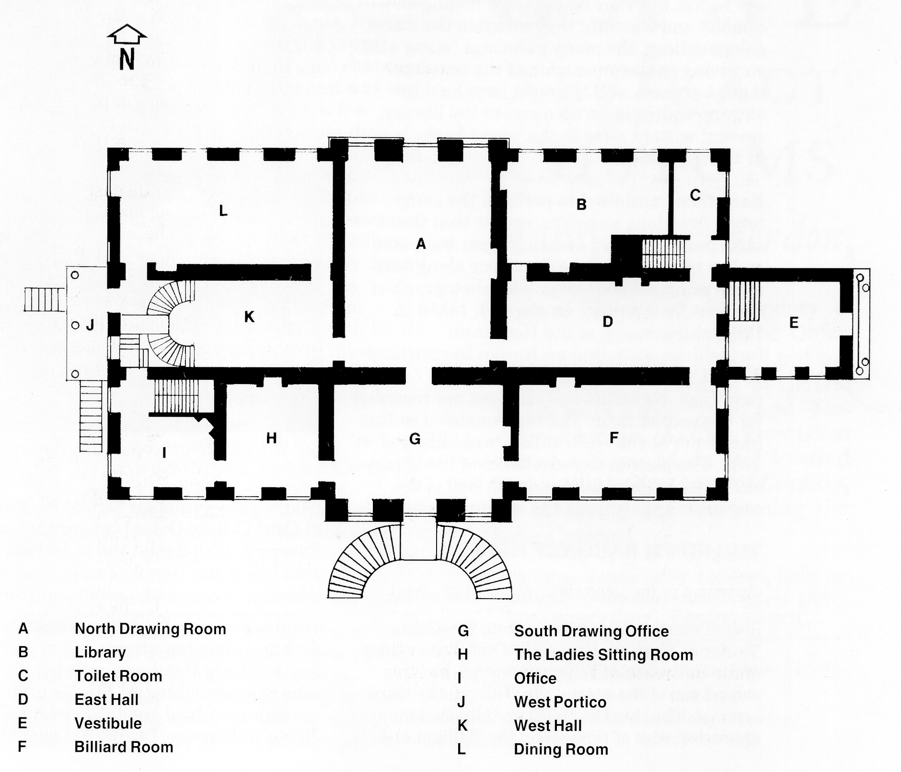

## Hursley Park House (1821 - 1902)

In altering Hursley Park House, Sir Thomas
replaced the pillared portico at the east end
with a large stone—faced vestibule with a flat
roof. The vestibule became the main carriage
entrance and the original fanned steps of the
old carriage entrance at the centre of the
north face were removed. It is not known
when the double steps outside the south
drawing room were removed, but by 1900 they
were no longer in evidence. Other alterations
included the conversion of the original north
entrance hall into the north drawing room to
form two connected drawing rooms in the
centre of the house; and the re-siting of the
main staircase at the west end of the house,
serving as before the ground and first floors.
The removal of the original staircase and a
partition wall produced a room 40 feet (12 m)
long in the north—west corner of the house;
this became the dining room. A room of
similar size was formed in the south-east
corner by removing another partition wall,
and this became the billiard room. The
accompanying plan of the ground floor shows
the layout after these alterations. In the new
north drawing room, the stone floor of the
previous north entrance hall was replaced
with an oak floor to complement the oak
panelling on the walls. It is possible that the
internal store rooms off the old east and west
corridors were removed at this time to form
the 16 foot (4 m) wide east and west halls,
both leading off the north drawing room. The
new staircase in the west hall allowed access
to the off-centre door in the west portico. For
improved natural light in the first floor long
gallery, two skylights were introduced in the
roof, so that light could flood down into the
second floor gallery, and continue on down to
the first floor gallery through glass panels in
the ceiling.

During the building alterations, many other
rooms were reappointed: the library was fitted
out as it is today with its oak panelling, high
gallery and staircase, and bookshelves on all
walls except the lower internal wall which has
the fireplace backing onto the hall; and double
doors became a feature of the main central
sitting room. It seems that there was no
longer any access to the east end of the lower
ground floor corridor because of the new
vestibule’s design; some five steps ascended
from the vestibule to the ground floor of the
house.

*Ground floor plan (1821)*

The best descriptions of the inside of Hursley
Park House come from nineteenth century
biographies in which several writers speak of
the house as being ‘Well lit’, ‘unostentatious’,
‘warm and comfortable’, and having ‘an
atmosphere that was happy and stable’.
Published descriptions of the reception rooms
are vague, but they do convey a feeling of
comfort and warmth: they mention the warm
oak panelling, the many paintings (many still
surviving in the ownership of the present
tenth baronet), and the open fires held in
elegant andirons. In accounts of the library,
several writers refer to the ‘many books bound
in Hursley green’.

Each floor continued to perform the same
broad functions as before, except that the
state bedrooms and dressing room were now
on the south side of the first floor along with
other principal bedrooms. The photograph of
the first floor gallery on page 44, taken in
1901, shows many of the Heathcote
furnishings including an Italian harpsichord
of 1721 featured in one of the family
paintings. No structural changes are recorded
for the second floor. The house existed in this
form from about 1821 until it was enlarged in
1902\. The present day excellence of the library
and other original fittings speak well of the
original craftsmanship and quality of materials.