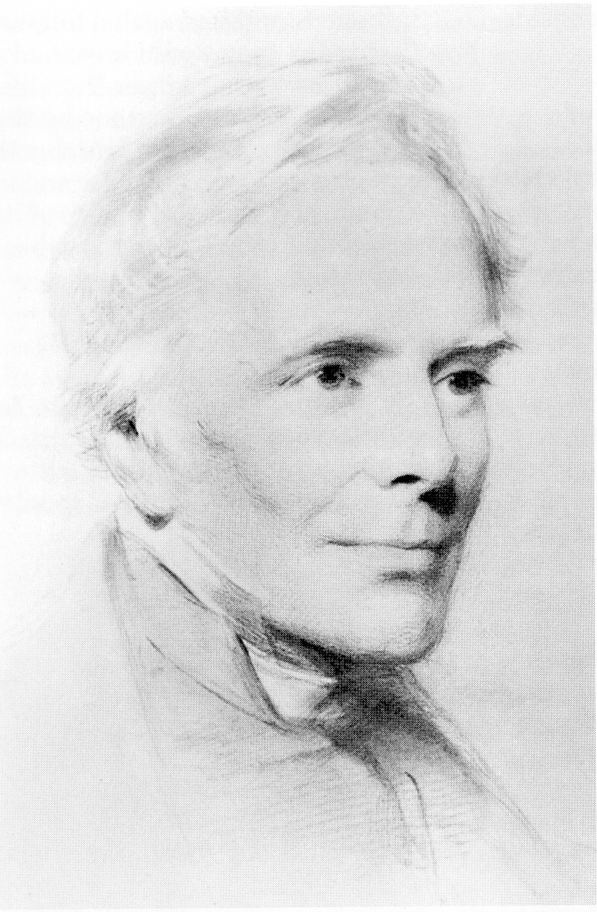

## John Keble and Friends

On St Mark’s Day (25 April 1792), one of
Hursley’s great names, the Reverend John
Keble, was born at Fairford in Gloucestershire.
That he should become one of the most famous
Anglican (Church of England) clergymen never
to have become a bishop owes something to
his father, the elder John Keble (another
Reverend) who educated his family entirely at
home. The male family members were sent on
to university, which for the young John was at
the age of 15.

Keble went to Corpus Christi College at Oxford,
and later became Fellow, Tutor and Professor of
Poetry at Oriel College. There he tutored a
young William Heathcote, later Fifth Baronet of
Hursley, who in 1825 offered him the curacy at
Hursley. Keble stayed for just a year, but
returned as vicar in 1835 following the death of
his father, and remained there until his own
death in 1866.

*John Keble, by George Richmond RA, 1863*

But what made Keble famous, and Hursley a
place of pilgrimage for so many? Keble was
the author of many volumes of sermons and
theological essays, and a reformer and the
senior member (the oldest) of the Oxford
Movement, a tractarian movement who urged
caution and a biblical approach to the many
changes taking place within the Anglican
church at the time. Without doubt, he was
also a man of his time with his poetry. His
book ‘The Christian Year’ (1827), a popular
collection of religious verse, met a real need
and was used by Anglicans in their daily
devotions. The royalties from this book, in
particular, helped pay for the rebuilding of
Hursley church in 1847-1848.

Some of his poetry was set to music, and so
the title of hymn writer accrued. He also
worked with William Baker, another hymn
writer, in compiling what was the then new
and somewhat revolutionary Anglican hymnal
‘Hymns Ancient and Modern’.

Unlike his contemporaries in the Oxford
Movement, Newman and Pusey, who too often
aroused conflict, Keble’s humble style of
Christian leadership was always reliable and
trusted. In contrast to some tractarians, Keble
felt it more important to show that erudite
theological principles could be of more practical
help in a Christian’s life than the ritual worship
on which others placed great stress. Many in
the hierarchy of the Anglican Church often
resisted comment on public issues until they
had heard ‘What came out of Hursley’.

Keble detested the competitive political
atmosphere at Oxford University and wanted
no part in it. He felt that he could function just
as well for the Church he loved as an ordinary
country clergyman, not seeking wider
recognition or promotion. What is often
overlooked is that Keble was an outstanding
pastor, a very good communicator, and a man
who was absolutely genuine, greatly respected
and to whom it was easy to relate. There were
no ifs, buts or maybes about where this shy
man of God stood, and people loved him for it.
This partially explains the paradox of a man of
great humility being so famous that, after his
death, a new college was built in Oxford as a
fitting memorial to him, funded entirely by
public subscription. So great was the response
that the College was operationally complete and
paid for by 1870, just four years after his death.
John Keble is buried in Hursley Village
churchyard, with his wife’s grave alongside
making a matched pair.

Sir William Heathcote, 5th Baronet of
Hursley, and John Keble were half of a
quartet of famous local Victorian people who
also helped make Hursley a focal point of
Anglican, judicial and administrative interest
in the 19th century. The two other greatly
respected personalities who also contributed
to putting Hursley on the map were the
novelist Charlotte Yonge, who lived at
Otterbourne, and the Reverend George
Moberley of the Red House at Ladwell, a
small hamlet about 0.62 miles (1 km) south of
Hursley, on the Chandler’s Ford road. He
lived here during his time as headmaster of
Winchester College, before becoming Bishop of
Salisbury.

Charlotte Yonge was something of a disciple of
John Keble, and her writing was influenced by
his ministry. Her skill with words to create
pictures in the mind still works today, and her
books, long out of print, are keenly sought
after. From the royalties of one of her books,
the little chapel/school room at Pitt was built.
Pitt is about 2 miles (3 km) north east of
Hursley towards Winchester. From the title of
one of her books, Ampfield, Chandler’s Ford,
Farley Chamberlain, Hursley, Otterbourne
and Pitt, are still known as ‘John Keble’s
Parishes’.

These four great Anglican stalwarts created
what was to be the heyday of Hursley’s social
life from around 1835 to 1865, and the
reputation of the highest ideals within this
little Hampshire Village spread well beyond
England’s shores. They were all greatly loved
and respected in their various fields of
influence, and had such a following of interest
that today they would have had star status.
There were other larger than life personalities
but these four set the tone by their example
and industry, for from Hursley they thrilled
and inspired many people, and it is around
this quartet that the wealth of literature
associated with the area has been written or
dedicated.

