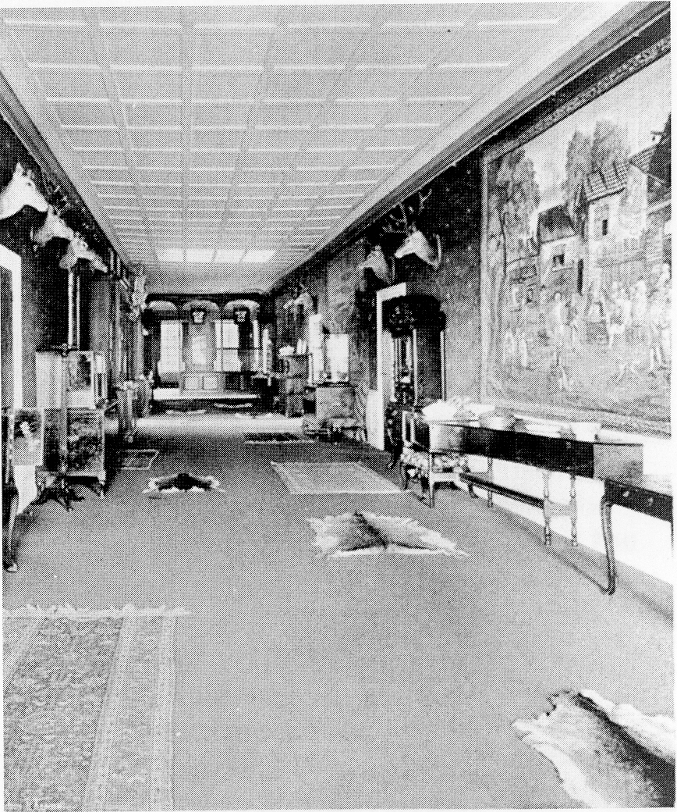
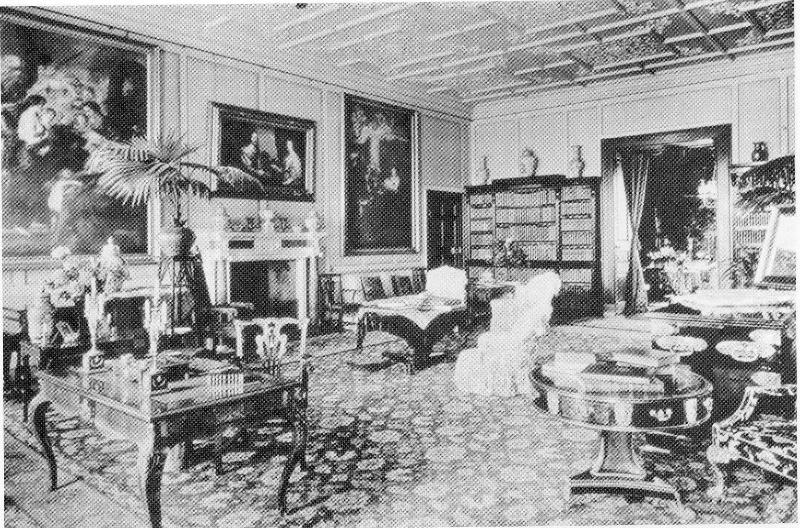
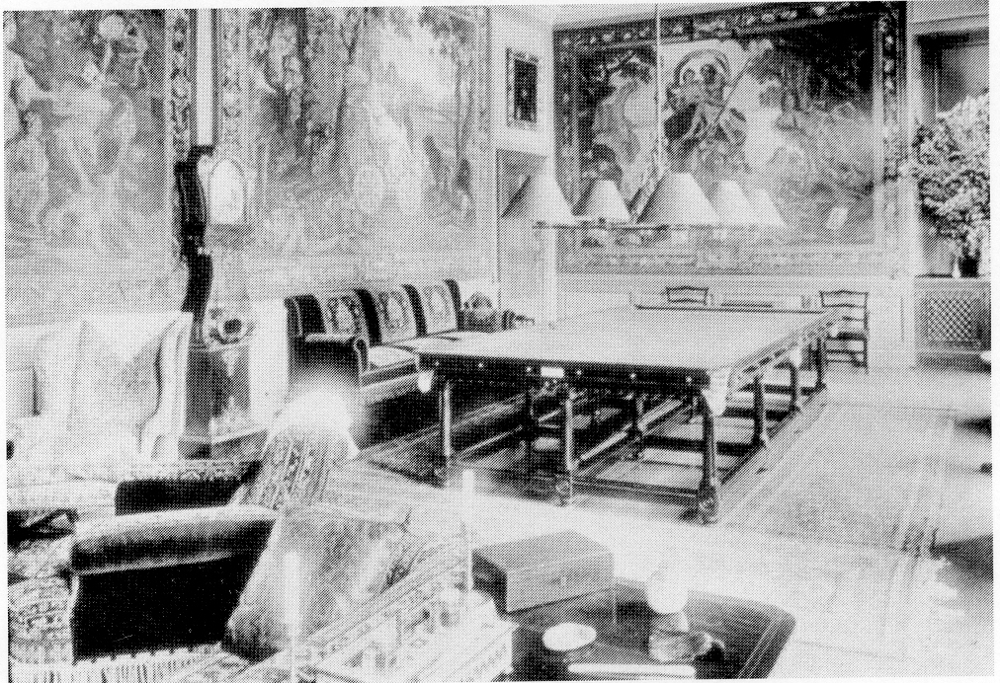
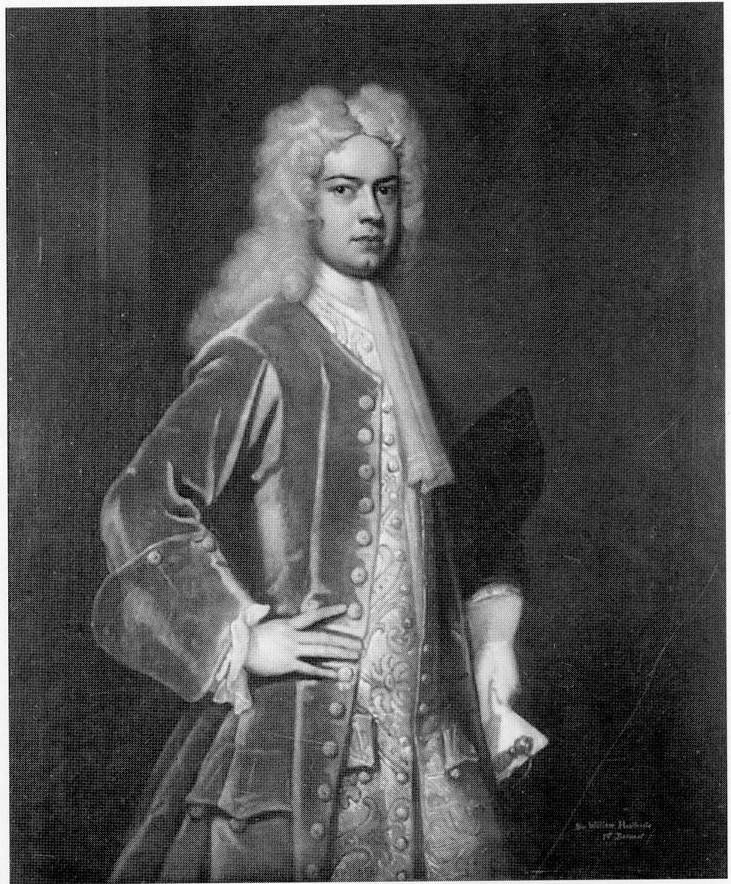

# Hursley Park House 1718 - 1902 (The Heathcote Era)

*The first floor gallery c. 1901*

*North drawing room*

*Billard room c. 1900*

*South drawing room*

## The Heathcotes

The Heathcotes came from Chesterfield in
Derbyshire. The family’s considerable
fortune was accrued by Sir William
Heathcote’s father Samuel, who as a
young man was a merchant in Danzig
(now Gdansk) and Konisberg (now
Kaliningrad) with his brothers. (Samuel’s
eldest brother was lord mayor of London
in 1711, and was the last lord mayor to
ride in procession on horseback.)

After Samuel returned to England, he
married and settled in Chesterfield. He
became a director of the East India
Company and also assisted in work on
regulating the coinage of the realm, the
‘gold standard’ - for which his friend John
Locke was famous. When Samuel died in
1708, his three surviving sons, Gilbert,
William and Samuel inherited his
considerable fortune. Gilbert, the eldest
son, died of smallpox at the age of 18
after which William (the first baronet of
Hursley) seems to have acquired most of
his father’s wealth and honours. William
appears to have continued in the family
mercantile business for a while with his
uncles; and in his early twenties, ‘he
began to draw home that part of his estate 
that he had abroad in trade, being fully
resolved to leave off trade and to be content
Because of the Cromwell family’s poor with this present estate’. When about 27
administration, the manor estate and lodge years of age, William married and in due
deteriorated to a low condition; this in turn course had six sons and three daughters. He
created a feeling of depression in the village. became MP for Buckingham, and later, in
When Sir William Heathcote purchased the 1729, MP for Southampton. To meet his
estate in 1718, he was welcomed for change’s obligations and expectations he required a
sake, and for the local people the change large house, and Hursley was chosen because
proved to be beneficial. of its location and potential.

*Sir William Heathcote, First Baronet*
