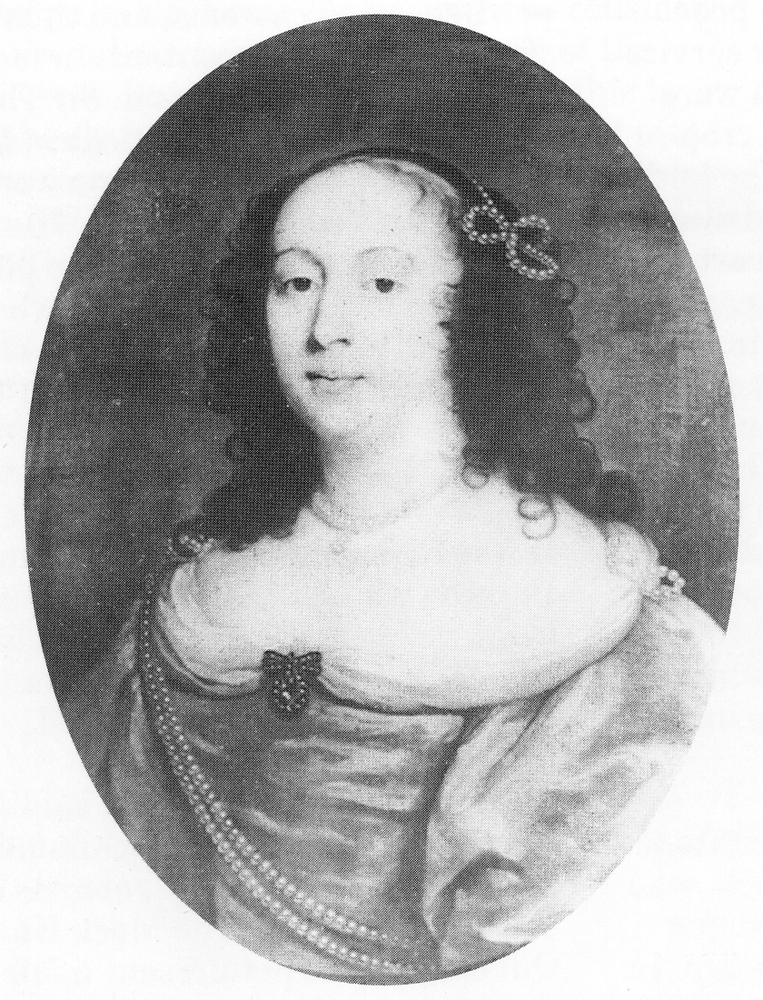
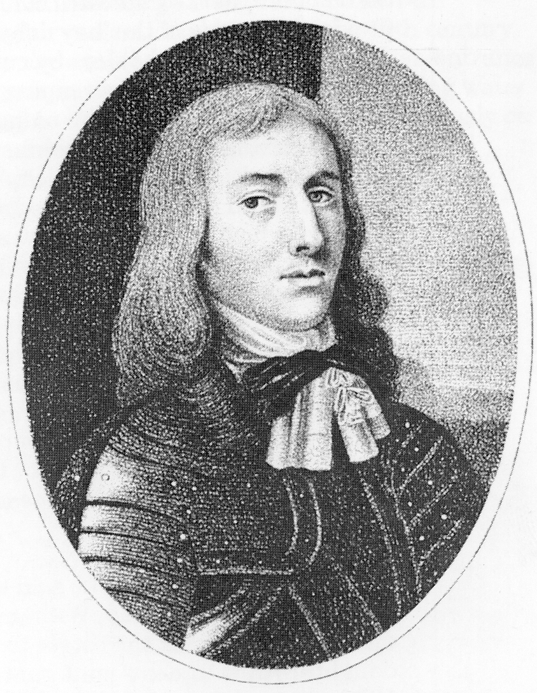
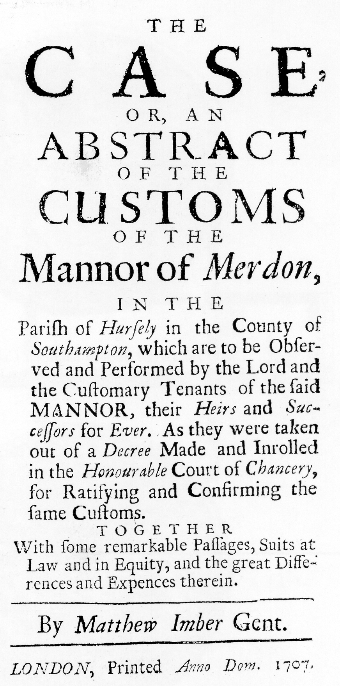
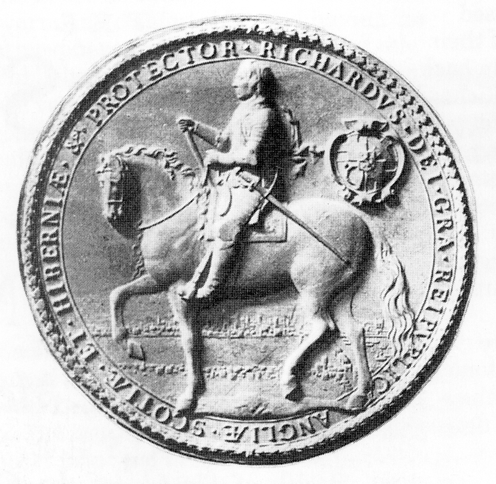
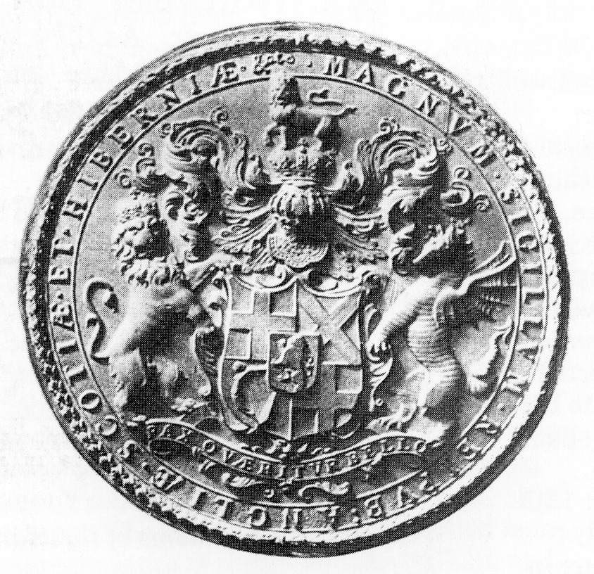

# Hursley Park House Site 1413-1718

## The 'Logge'
 
The history of buildings on the site of Hursley
Park House seems to have a definite starting
date of 1413. The Pipe Rolls for that year give
an account for an expense of £8 0s 7d credited
to a carpenter who ‘made a new building
called a logge in the park’. The design of the
logge was geared to hunting, and as such it
lasted for over 100 years. Prior to 1552, the
hunting activities must have dwindled, for in
that year the bishop of Winchester, one John
Poynet, surrendered to King Edward VI the
Merdon estate and other lands around
Winchester. The fact that an established deer
park was part of the Merdon estate must
have added enormously to its value.

A conjectured plan of this first building on the
site of Hursley Park House surmises that it
had two/three main rooms facing south, with a
butchery and pantry/kitchens at one end
under an extension of the thatched roof
reaching down to the ground. Behind the
three principal rooms would have been the
stables, probably with open access to the
north side, with an entrance through to the
domestic quarters. The thatched roof over the
whole building would have doubled as a hay
loft and sleeping quarters for the farrier,
groom, and any servants. A building larger
than this would have exceeded the recorded
building costs. The exact site of the logge is
not completely certain. However, pictorial
evidence and the position of a well suggest
that it could have stood in the area of the
present well house and bothy (a small cottage
to house estate workers, T Block today).

---
 

## The Cromwell Family

**[...end of missing page 27]**

monarchy. Because of the continuing hostility
and his considerable debts, he withdrew from
Parliament on 25 May 1659, and lived in
quiet seclusion at Hursley before departing for
France a year later. Accounts differ as to
where he lived with his wife on the continent
under the name John Clerke. Mrs Cromwell’s
portrait came to light in France in the 1970s.
During his twenty years in exile he wrote
numerous letters to his family, and was
greatly concerned over their welfare. His wife
died in 1674/76, which added to his sadness at
being in exile. He was long regarded as a
dangerous person by the government, who in
1671 made a strict search for him ‘but without
avail’. So Richard’s cover must have been
effective.

*Dorothy Cromwell (wife of Richard)*

*Richard Cromwell, Lord Protector c. 1658*

After the death of Dorothy Cromwell, their
eldest son Oliver ‘claimed Merdon in right of
her marriage settlement’ and took possession of
the estate. It seems that Oliver Cromwell II
was a rather spineless character with a
butterfly personality, who managed to degrade
further the poor relationships with the
copyholders.

His father Richard probably thought that,
since young Oliver had set his mind on
Merdon, this might be the opportunity he
needed to do something useful; so he did not
contest his claim. However, the oppressed
tenants, seeing no end to the erosion of their
rights and privileges, determined to win back
some essential rights they had lost to Richard
Major and the previous manor lords. No
doubt they reckoned that with the young
Oliver’s character they stood a good chance of
success, and in 1692 a chancery suit was in
progress which lasted until 1705, a few
months after Oliver’s death. Despite the
proceedings being drawn out, the tenants did
regain many of their rights. They also
established in law a yardstick for future
generations of tenants - an early milestone in
the quest for civil rights. In 1707, ‘Matthew
Imber (Gent.)’ translated the chancery decree
called ‘The Case, or an Abstract of the
Customs of the Manor of Merdon’ from
‘chancery hand’ and Latin into English for the
benefit of the tenants. About 80 of these
translations were published and today they
have become a much sought-after legal
artefact.

*Title leaf of the customs of the Manor of
Merdon, 1707.*

After his son’s death, poor Richard Cromwell
was in conflict with his two surviving
daughters Elizabeth and Anne who considered
themselves to be the heirs of their brother.
Because they were already in residence, they
disputed their father’s claim and so Richard
instituted proceedings against his daughters,
and was obliged to appear at Westminster
Hall, where Lord Chief Justice Holt treated
him with much respect and made an order in
his favour. Richard was then entitled to live at
Hursley as lord of the manor. He also spent
some of his time at his other house at
Cheshunt where he eventually died on 12th
July 1712 at the age of 86. He was duly
interred with much pomp and ceremony in
the chancel of Hursley church near his wife.
His daughters inherited the estate, but they
lived at Hursley for only a few years before
selling the whole manor in 1718 for £35,100
to William Heathcote who was later created a
baronet in 1733. It was this Sir William
Heathcote who had the Great Lodge
demolished because it was in a ruinous state;
the proposed renovation and alterations did
not satisfy his requirements and were too
costly. During the demolition of the Great
Lodge, the die of the Great Seal of the
Commonwealth was found in a crevice in a
wall. It is believed that Richard Cromwell
took the die from Parliament and hid it for his
own security.

*Die of the Great Seal of Richard Cromwell,
Lord Protector c. 1658. (Diameter 14 cms, 5.6”)*
