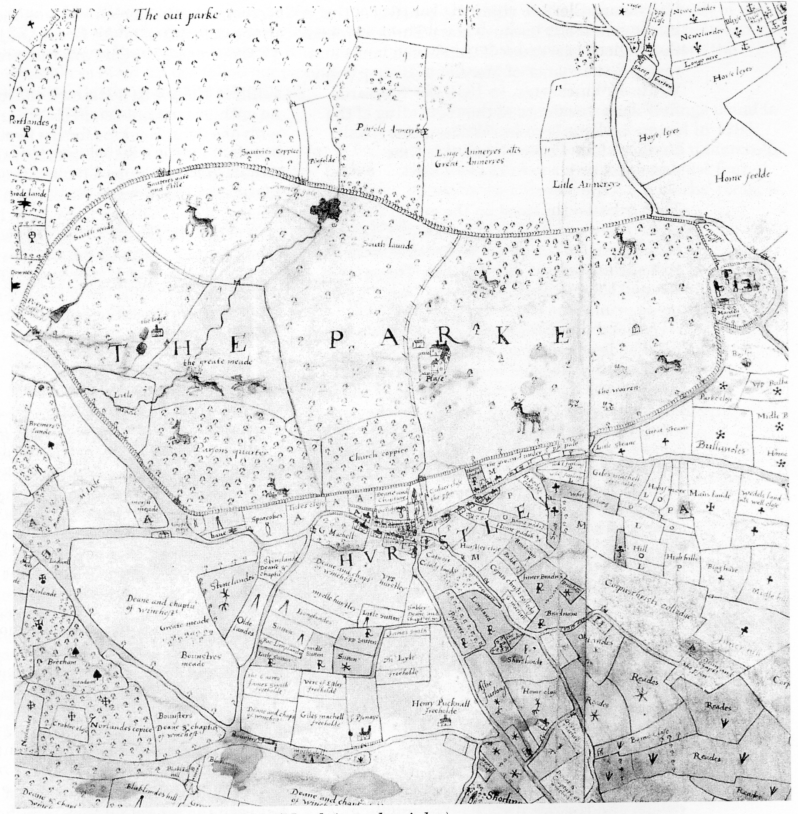

# Hursley Park House Site 1413-1718

*North elevation th Great Lodge c. 1725*

## The 'Logge'
 
The history of buildings on the site of Hursley
Park House seems to have a definite starting
date of 1413. The Pipe Rolls for that year give
an account for an expense of £8 0s 7d credited
to a carpenter who ‘made a new building
called a logge in the park’. The design of the
logge was geared to hunting, and as such it
lasted for over 100 years. Prior to 1552, the
hunting activities must have dwindled, for in
that year the bishop of Winchester, one John
Poynet, surrendered to King Edward VI the
Merdon estate and other lands around
Winchester. The fact that an established deer
park was part of the Merdon estate must
have added enormously to its value.

A conjectured plan of this first building on the
site of Hursley Park House surmises that it
had two/three main rooms facing south, with a
butchery and pantry/kitchens at one end
under an extension of the thatched roof
reaching down to the ground. Behind the
three principal rooms would have been the
stables, probably with open access to the
north side, with an entrance through to the
domestic quarters. The thatched roof over the
whole building would have doubled as a hay
loft and sleeping quarters for the farrier,
groom, and any servants. A building larger
than this would have exceeded the recorded
building costs. The exact site of the logge is
not completely certain. However, pictorial
evidence and the position of a well suggest
that it could have stood in the area of the
present well house and bothy (a small cottage
to house estate workers, T Block today).

## THE GREAT LODGE (THE OLD LODGE)

After the Merdon estate was surrendered to
the crown in 1552, Edward VI granted the
Manor of Merdon to Sir Philip Hoby in the
same year ‘to be held in chief for the fortieth
part of a knight’s fee’. Sir Philip Hoby is
credited with building the Great Lodge in
Hursley Park around 1554. However, owing to
the legal problems created by the death of
Edward VI, which thwarted the progress of
the necessary act of parliament, Sir Philip
Hoby was unable to enjoy the benefits of the
king’s generosity because Mary Tudor revoked
the original surrender of the church lands and
restored the manor of Merdon to Bishop John
White of Winchester. In 1559 the ‘Stewards
Roll’ shows evidence of the regranting of the
estate by Elizabeth I to William Hoby, half
brother of Sir Philip Hoby - this time
permanently.

The Great Lodge stood on the site of the
present lawn on the southern side of Hursley
House, and its traces are still visible from the
roof of the house in dry weather. The print of
the north elevation of the Great Lodge was
made prior to its demolition, probably for
record and proposed alteration purposes. The
print shows there were two wings - the west
wing being wider and longer than the east
wing. These wings formed a courtyard on the
southern side. The print also shows the
garden wall with gates either side of the
house; this wall continued round to form an
almost square walled garden of about one acre
(0.4 hectare). The wings appear to have been
part of the original design and not additions.
A map dated 1588 (some 33 years after the
Great Lodge was built) shows the wings, the
garden wall and - to the west - a smaller
building roughly where the present bothy
stands. This smaller building could be a
replacement for the original wooden lodge of
1413, subsequently used as a stable and
having a tiled roof. This building could have
lasted in part through to about 1728 and
being originally made of wood it must have
been renovated several times. Also evident in
the print are the Great Lodge’s mullioned
windows which are small in number and size.
These windows, together with the impractical
design and run down state of the building,
were among the decisive factors that resulted
in the demolition of the Great Lodge in the
1720s — some 170 years after its erection.

William Hoby was a staunch churchman and
an enthusiastic musician. He was responsible
with one John Hopkins for the first ‘sounding
out the Psalms of David in metrical verse’. It
is said that ‘he employed much time in singing
his psalms to his organ for his own Godly
Solace’. When William Hoby died, in the latter
part of the sixteenth century, his son Giles
inherited the estate. In 1600, Giles Hoby sold
Merdon Castle and Manor to Sir Thomas
Clerke, his father-in-law, but kept a life
interest in the Great Lodge and surrounding
land at Hursley.

*Outline of Great Lodge foundations, photographed from the roof of H ursley House in 1976*

 
MERDON MANOR

Merdon Manor house seems to have come into
existence between 1552 and 1588 and was
either the larger of a collection of some
dwellings grouped approximately half-a-mile
to the west of Merdon Castle, or the principal
house on the site of Merdon Castle. The map
dated 1588 shows that Merdon Castle had
within its earthworks buildings that look like
a farm that was large for its day; it consisted
of five substantial buildings in an orderly
layout typical of many old farms today. (The
farm existed until about 1843 when it was
replaced by the present Home Farm, leaving
the Norman earthworks clear of later
developments.) The manor rights seem to
have been transferred to Hursley’s Great
Lodge around 1659 when Richard Cromwell
took up residence before his exile.

Around 1602 there is an account of a quarrel
between the tenant farmers (copyholders) and

*Map of Hursley deer park, 1588. (North is to the right.)*

**Next: Page 27**
