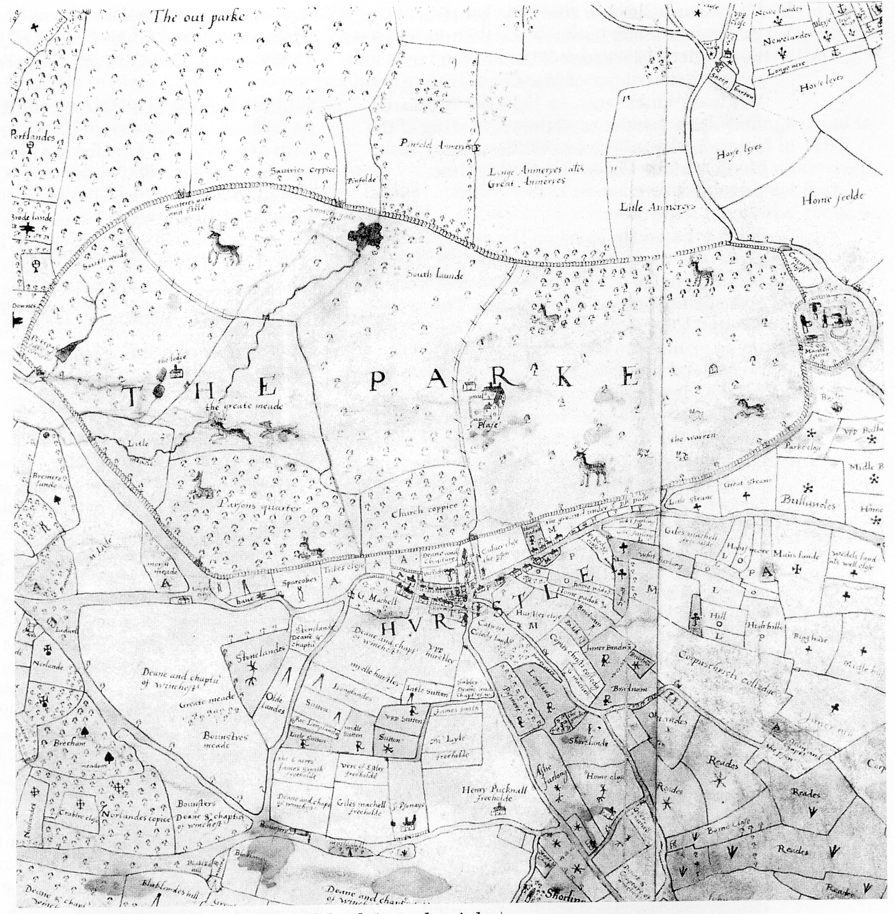

## Merdon Manor

Merdon Manor house seems to have come into
existence between 1552 and 1588 and was
either the larger of a collection of some
dwellings grouped approximately half-a-mile
to the west of Merdon Castle, or the principal
house on the site of Merdon Castle. The map
dated 1588 shows that Merdon Castle had
within its earthworks buildings that look like
a farm that was large for its day; it consisted
of five substantial buildings in an orderly
layout typical of many old farms today. (The
farm existed until about 1843 when it was
replaced by the present Home Farm, leaving
the Norman earthworks clear of later
developments.) The manor rights seem to
have been transferred to Hursley’s Great
Lodge around 1659 when Richard Cromwell
took up residence before his exile.

Around 1602 there is an account of a quarrel
between the tenant farmers (copyholders) and

*Map of Hursley deer park, 1588. (North is to the right.)*

**[Start of missing page 27...]**
