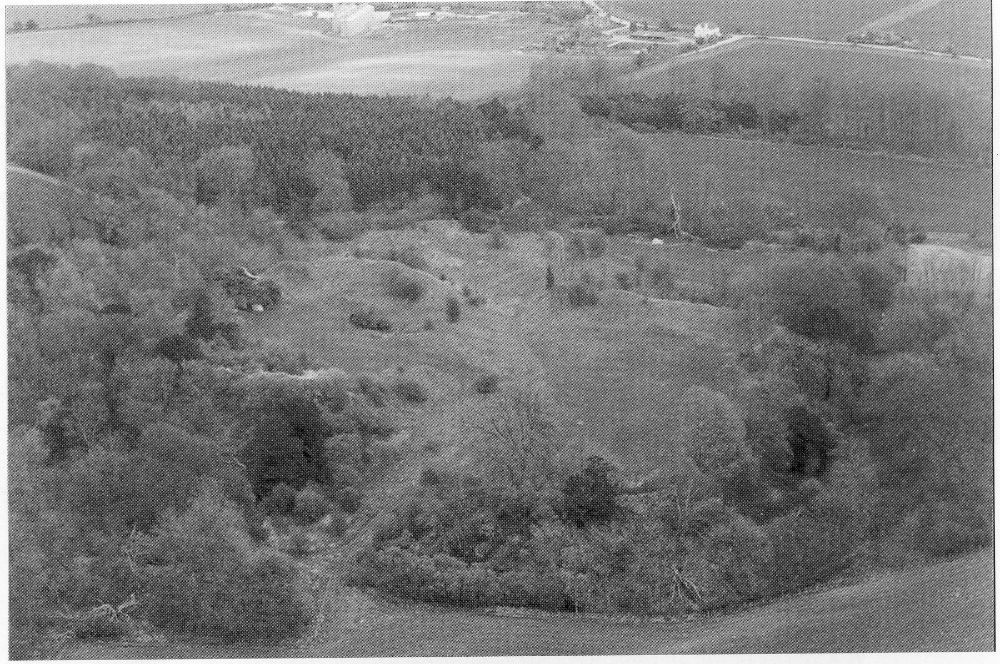

## Castle Remains

Merdon Castle stands on a ridge of rising
ground, north of Hursley Park House. Its
earthworks, with ramparts up to 60 feet (18 m)
above the floor of the dry ‘moat’, were divided
into two parts: the north part enclosed the
main apartments; the south part (the bailey)
enclosed stables, barns and other outhouses.
The medieval earth works were set in the
middle of an Iron Age hill fort whose
earthworks are most pronounced to the east
with a rampart (now) of about 14 feet (4.2 m)
above a shallow ditch. Because the castle is
small, it is almost certain that the area
between the castle and this Iron Age ring was
occupied by the Bishop’s lesser attendants -
such as his guards.

It is certain that, to save expense and labour,
each successive occupant of the site would
have made use of, and added to, the works of
earlier occupants, especially for defence.
Pales and ditches are frequently referred to in
the Bishop of Winchester’s accounts, and
these are still visible throughout the Park.
For 300 years within the earthworks of both
the inner circle and the bailey, there had been
a farm (now replaced by the present ‘Home
Farm’ complex). This was dismantled some
150 years ago, but such occupation of the site,
with the main track running through it, must
have disturbed or obliterated many traces of
earlier occupation.

In the north enclosure of the castle, the west
bank has a flint wall partially buried in it. In
the centre of the north bank are the
substantial remains of a small tower 38 feet
square (11.4 metres), now two stories high,
and divided into two chambers by a stout
cross wall. Its walls are flint with ashlar
quoins (dressed stones principally used for
doors, windows and corners), but the tower is
now too badly damaged for any features to be

**[ Page 18 missing? ]**

adjacent to the tower the ‘moat’ is spectacular
in spite of the in-fill of brambles and
undergrowth,and the considerable width to be
spanned for a supposed entrance seems
impractical. Despite destruction of the castle
fabric in the 15th century, its remains are in
better shape than the remains of some of
Bishop Henry’s other castles. Merdon’s site has
benefited from being off the tourist’s map,
largely because of its hidden position within a
private enclosed estate.

 

*Aerial view of Castle from the south-west, 1993*