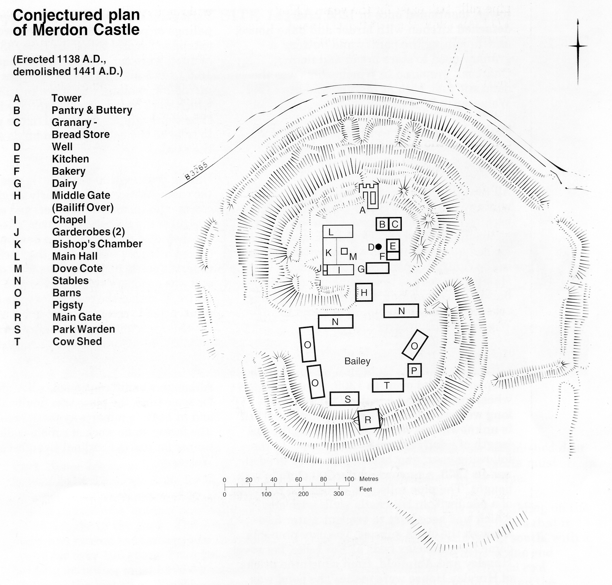

## Pipe rolls

The bishops of Winchester kept manorial
accounts that were summarised in annual
counter-rolls, known as ‘pipe rolls’ in
imitation of the King’s pipe rolls. These
accounts list the income, expenditure and
stock of the Bishop’s many estates, and
include details of crops, rents, legal
transactions, and expenditure on wages,
equipment, buildings and entertainment. The
pipe rolls still exist for the years 1208
to 1711, although the last two centuries
are less informative. From these accounts
it is possible to build up the following
picture of Merdon Castle in the thirteenth
and fourteenth centuries.

*A heading of the Merdon accounts from the Bishop's Pipe Rolls of 1334.*
**(Hampshire Record Office Copyright Reserved.)**

Entering the castle from the south, one
passed through the main gate into the Bailey
containing the stables, cow shed, pigsty, barns
and the Park Warden’s house all built of
wood and wattle. Over the middle gate,
between the Bailey and the inner courtyard,
were the Bailiff s quarters.

The inner court had all the buildings usual to
a medieval manor: a hall, renewed in 1298;
the Bishop’s chamber raised on an undercroft,
rebuilt in 1283; a chapel with at least four
windows mentioned in 1252; a clerks’ room; a
tower, mentioned once in 1286; a large
detached kitchen with larder and bake house;
and, adjoining the pantry and buttery, a
granary used to store bread and flour.
Charcoal, prepared in Winchester - was the
domestic fuel, both at Merdon and at
Wolvesey in Winchester.

*Conjectured impression of castle inner court c. 1300*

The main buildings were of stone, but wood
(mostly oak) was used whenever possible,
especially for ‘timbers, laths and shingles’.

All the buildings were plastered and
whitewashed, and roofed with shingles. A
pentice ran between the hall and the chapel,
alongside the Bishop’s chambers, and in the
formed quadrangle was a lawn with dovecote
in the centre. (A pentice in this part of
Hampshire relates to an upper storey of a
building overhanging a pavement, providing
cover from the elements, as is found in
Winchester High Street.)

Across from the dovecote, near to the
kitchens, was the well, which was extremely
deep and roofed over. In 1309, it had a cog
wheel inserted and a leather rope 44 ‘tails’
long was provided. (The exact length of a ‘tail’
is unknown, but was probably about the tail
length of a fully grown horse or cow.) In the
following year, another 42 tails were needed,
and in 1358, a rope weighing 300 pounds was
bought. The pipe rolls also record the relining
of a pond within the castle walls with clay,
which was necessary to prevent water loss
through the chalk subsoil. The clay probably
came from the clay beds at Rat Lake, between
Hursley and Ampfield, from which the bricks
of Hursley House were made. The pond was
used for watering the animals.

Park pales (ditches and banks topped with
palings or pointed fencing poles) were cut and
extended several times. In 1286, 33 ‘perches’
of ditch were cut. Today 1 perch equals about
16.5 feet (5 m). In 1307, 90 perches were cut
in ‘the big campus’ and more in 1330, all of
which were immediately planted when cut.
(The word campus was used in the pipe rolls
to refer to the enclosed farm lands south of
the castle.)

During the next 100 years, little was spent on
the castle. It was used regularly for church
ceremonies (mentioned earlier) and as a hunting
centre for the Bishops. However, after 1400 its
use dwindled until, in 1413, a new building
(called a ‘logge’) was built in the Park. By this
time, the castle had fallen into total disrepair,
and was no longer suitable even as a hunting
centre. Whether the park pales were initially
constructed to create a deer park is not certain,
but this is certainly what this area was in use
for in the 1400s, and where better to have the
‘logge’ but near the centre?

Although a bailiff continued to live at the castle
for some time, the place was finally abandoned,
and in 1441, ‘a miner was sent to rob ashlar’
(the facing stone work of rubble walls) ‘and
timber for use in Cardinal Beaufort’s palace at
Wolvesey’.