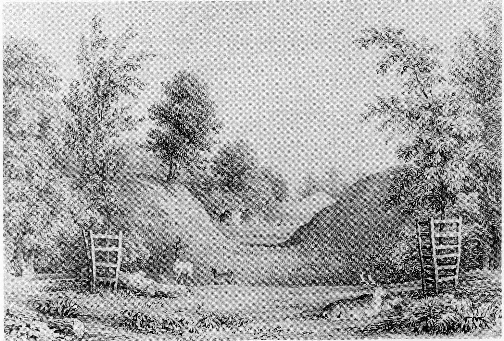

## Stephen-Matilda Wars

It is not from the Doomsday Book (no mention
there of Merdon, because it was church
property), but from the Annales Monastici
(Annals of the Monastery of Winchester) that
we hear of Merdon in the year 1138. They
record the building of Merdon Castle by
Bishop Henry de Blois, (half-brother of King
Stephen, the last of the Norman monarchs)
for defence in the Stephen-Matilda (Maud)
wars.

These were messy and drawn out affairs
which lasted 18 years, brought about by
Stephen dishonouring oaths he had made and
renewed to Matilda in the presence of her
father, King Henry I. When Henry died in
1135, Matilda was out of the country having
married Henry V of Prussia, and Stephen took
this opportunity to seize the treasury at
Winchester and to discredit Matilda, claiming
that his oaths had been made under coercion.
He also claimed that Matilda was unsuited to
have the crown because, first she was just a
mere woman, and second she had married a
foreigner whose interests were not those of
the English people. (Indeed she married yet a
second foreigner.) The good side of Stephen
was that he was a very modern man and an
able administrator.

In 1139, a number of bishops who had been
badly treated by Stephen declared themselves
against him under the leadership of his half-
brother Henry de Blois. Matilda returned to
England and finally discredited Stephen.
Sporadic rebellions became wars that
continued until 1153, when Stephen’s heart
went out of the campaign, and he
acknowledged Matilda’s eldest son Henry II as
heir in a negotiated settlement, after the
death of his own eldest son and the loss of
some close supporters.

The following translation from the Annals
Monastici for the year 1138 puts the mood of
the times across quite vividly:

> ‘This year Bishop Henry had built a house like a
palace with a very strong tower in Winchester,
and castles at Merdon, Farnham, Waltham,
Downton and Taunton; Roger, Bishop of
Salisbury, built castles at Salisbury, Sherborne,
Devizes and Malmsbury; the Count of
Gloucester strengthened Gloucester, Bath,
Bristol, Dorchester, Exeter, Wimbourne, Corfe
and Wareham; Brian strengthened Lincoln;
John Marshall, Marlborough and Ludgershall;
Godfrey de Mandeville, the Tower of London
and Rochester. There was not anyone of merit or
moment in England who did not build or
reinforce their strongholds.’

*Merdon Castle - print by G F Prosser c. 1860*

The building of six castles in one year by
Bishop Henry was aided by the wealth of
Winchester as the richest See in all England
(with over forty manors), and his leadership
among the bishops testifies to him as the most
powerful man next to the King.

An old story of one later wily bishop, when
offered the Archbishopric of Canterbury,
commented that ‘although the manger was
higher at Canterbury, the straw was richer at
Winchester’. This underlines the resources
that Bishop Henry had available for such
massive projects.

 

 

