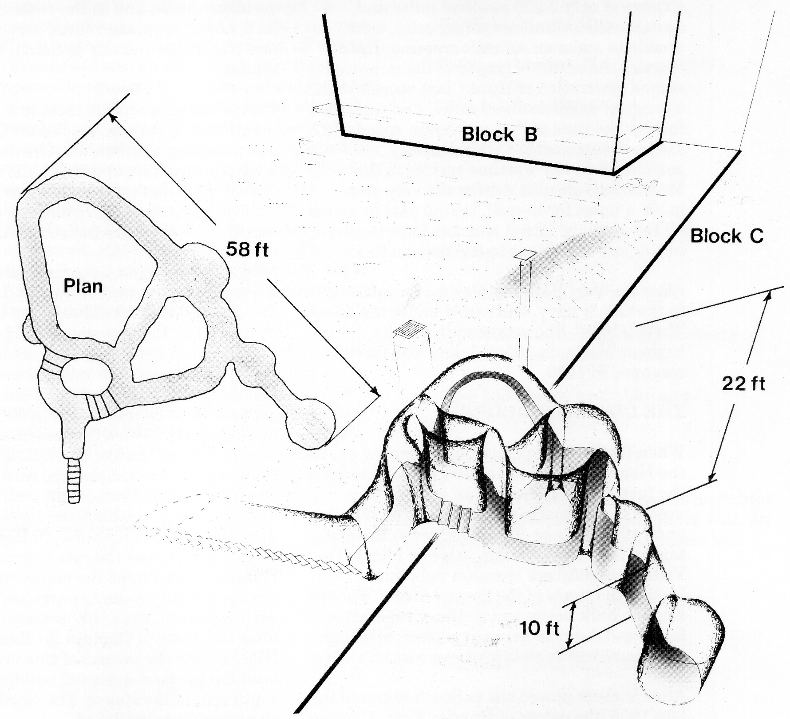
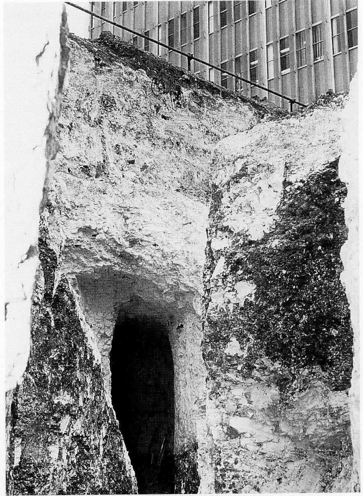
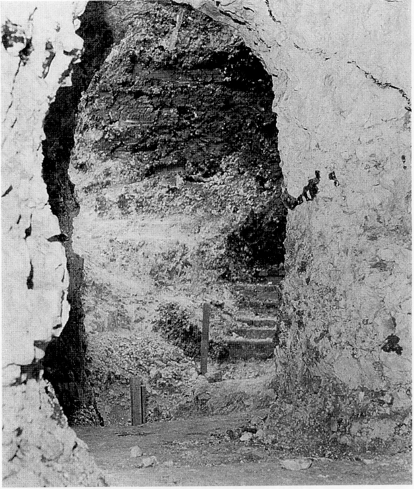

# TUNNELS AT HURSLEY

For over 200 years there have been stories
concerning the existence of tunnels in and
around Hursley Park. Some of these stories

Diagram of C Block tunnel system

are clearly fanciful, though there is enough
evidence of some real tunnels to see What
could have inspired some of the tales.

Stories of tunnels extending over 200 yards or
metres in length have to be treated with
considerable scepticism, especially when
balanced against both the enormous amount
of excavation work and the associated
problems in maintaining secrecy that would
have been involved.

To date we know about three certain tunnel
systems in the area, and one possible and two
very dubious tales concerning long tunnels,
one of which was said to run from the well at
Merdon Castle to a well in Hursley village,
and the other from the Park House to the
church or one of the houses in the village.

The first dubious claim of a tunnel is a nice
piece of folklore about a duck that fell into the
well at Merdon Castle (remember it is about
300 feet (90 m) deep) and turned up in a well
in Hursley village a day or two later minus
some of its feathers — a straight line distance
of over 0.62 miles (1 km)! When the Castle
well was explored in the early part of this
century, no tunnel or anything resembling
such was found, either above or below the
water line, only a great number of pins, an
ashen wood maser bowl and debris.

The second fable concerned a tunnel said to
run from the House to the village, and has
been disproved by all the deep excavation
work between the Park House and the Village.
This would have cut through any such system
but did, in fact, find some tunnels that went
absolutely nowhere.

Of the three known tunnel systems, the one
which was by far the most interesting and
puzzling involved a system found when the
footings for C Block were being excavated.
(See illustration on opposite page.) It
consisted of three loops of tunnels linking
together in a triangular form, with the two
larger loops joining into a common gallery 56
feet (17 m) long and furthest in. The floor
level descended to about 24 feet (7.25 m)
below ground level from the entrance. The
drawing shows passing or possibly defence
bays up to 8 feet (2.5 m) in diameter, and an
average tunnel width of just over 3 feet (1 m),
with a height of 10 feet (3 m).

 

Opening into C Block tunnels, with old B
Block in the background.

The assumption that this was an unfinished ice
house is highly unlikely; the design and
proportions did not fit and would have
represented a lot of unnecessary work. Also
whatever the tunnels were intended for, they
had all the appearances of having been finished.

One conjectured impression is that it was a
decoy and a trap, probably constructed in
Cromwellian times. Assuming that pursuers
were expected, those being hunted could go to
a separate temporary safe hiding place,
knowing that the entrance to the tunnels
would be found before their temporary hiding
place was discovered. Once the pursuers had
gone down and started going round in circles,
losing their sense of direction, the escapers
could block the entrance and make their
getaway. As no human bones were found,
could we assume it was never put to the test?

Another possibility is that this was the real
hiding place, and should the pursuers find it,
then the layout would be confusing to them,
and those hiding could readily defend
themselves inside the system.

It was always a puzzle to the gardeners at
Hursley why a particular part of the walled
garden would occasionally and suddenly
subside, requiring a load of top soil to restore
the level. This was the answer, as the steps
leading down into the tunnels started at this
point.

Around the perimeter of Hursley House, with
a spur going out under the stables, there is a
service tunnel that was constructed of brick in
1902/03 when the House was extended and
remodelled for Sir George Cooper. The spur
was to take the sewage out to the cesspools

 

Original steps down to C Block tunnels

adjacent to the Hursley Park Cricket Field,
now the site of a copse. These cesspools were
in use up to the early sixties, and one assumes
that they were well constructed and covered
over, as no mention is made of a unique
aroma in the Hursley Park Cricket Club
records. This perimeter tunnel to the House is
now a valuable feature for network and other
cables to serve the House, out of sight but
accessible.

The last known tunnel is one that is believed .
to have run from the King’s Head public house
in Hursley village to the lych-gate cottage by

the church. The only evidence for this are the
now bricked up ends visible in the respective
cellars. What state the tunnel is in between
the blocked up ends, or why it was
constructed, is not known.

The tunnel with unsubstantiated evidence of
existence is said to be on the north side of
Merdone Castle, and under the road that runs
from Lower Standon Farm on the Winchester
to Romsey Road, and goes to Farley
Chamberlain, Slackstead and on to
Braishfield. The road once had the name of
Feather Bed Lane, probably because its
earlier unmade surface was anything but. The
evidence comes from the observation of steam
roller drivers, who identified a place where a
tunnel could be sited from the tonal change in
the rumble the rollers made over the road’s
surface, normally associated with a culvert or
similar passage under a road. The near silent
operation of steam engines allowed the drivers
of steam rollers to hear more clearly any
change in the tone of the rollers' rumble over
the road surface than would be possible with
later internal combustion engined road
rollers. That this tunnel went all the way to
Oliver’s Battery, a distance of about 4 miles or
6.5 kilometres, makes a nice story but does
classify it in the fanciful bracket. This fable
may, though, be a clue to there once being a
well hidden track to that part of Winchester’s
outskirts, where a tunnel could have formed a
link at the castle end. The close proximity of
the castle has naturally led to the assumption
that this tunnel, if it exists at all, went right
into the castle. To do this it would have to
descend some 60 feet (18 metres) to get under
the dry moat, with a similar climb up to the
castle’s inner circle ground level again. Also
such a route for the tunnel would make it a

perfect sump for any water seeping through,
and render it impassable at different times,
with the moat itself naturally directing any
surface water to where it would add to the
problem.

It is doubtful, even after the passage of time,
that other ‘passages of time’ will be found in
Hursley Park. Stories of tunnels are part of
Hursley’s folklore, and in one case did provide
an obscure clue to the existence of the tunnels
that went nowhere. Hopefully the steam roller
clue will at some time be checked out to see if
there really is a tunnel adjacent to Merdone
Castle, and where it started and finished.