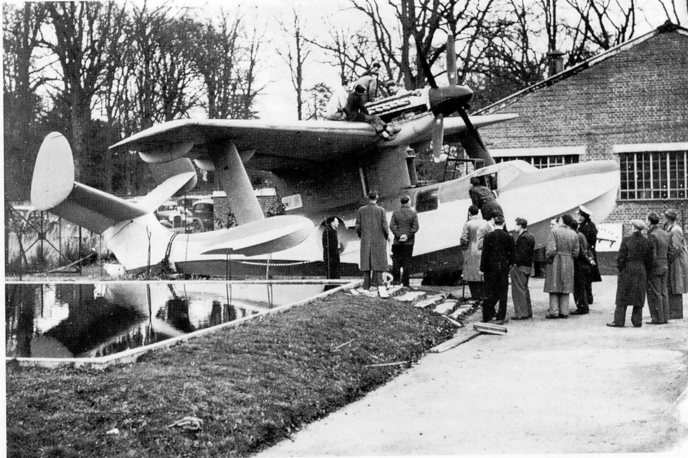

## Problems Resolved

Between Easter and summer of 1941 a quick
way had to be found to achieve a pressurised
cockpit for the Spitfire Mk VI. At that time
the R.A.F. did not have a suitable fighter to
compete with enemy aircraft bombing from
altitudes of 40,000 to 45,000 feet (12,200 to
13,700 metres). Research had gone on into
this problem since 1939, and the staff were
now able to achieve a cockpit pressure of 2 psi,
having called upon the experience gained with
the cockpit for the high altitude Wellington
bomber being developed at Weybridge in
Surrey, together with Rolls Royce engine
engineers. This led to the Marks VI and VII
Spitfires, and later to pressurised cabin
aeroplanes.

In a bid to get much-needed roller bearings
from Sweden, a Spitfire on floats was required
to fly into and land on a Norwegian fjord to
collect bearings smuggled in from Sweden by
the Norwegian underground. Hard and long
hours were worked on this, and when the
aircraft took off for trials on Southampton
Water, it took over 2 miles (3.2 km) to rise
from the water, causing much worry and
concern among those involved. During a flight
over the Channel, the pilot tried to return
over Bournemouth Bay area, only to be fired
upon by our coastal defences damaging the
aircraft and floats. Evidently Coastal
Command had not been advised of the flight
and the gunners, not identifying it, opened
fire. Eventually the problems were overcome
and the plane operated with success from
Scottish lochs, supported by a team of people
from Hursley.

Another episode was the development of the
ejector seat, which was built by Martin-Baker
Aircraft Limited whose managing director
and chief designer was Jimmy Martin, a
larger-than-life character acknowledged to be
very rough but extremely brilliant. However,
the person regarded as the real hero in
Martin-Baker was Benny Lynch, who has the
distinction of being the first person to be
ejected by an ejector seat from an aircraft.

 

*Benny Lynch on ejector seat test rig.*
**Photo: © Martin Baker.**

Also he literally sat in on all the early ground
experiments. Benny Lynch’s recognisable
characteristic was his handlebar moustache,
which he twisted with sophisticated panache
after each experiment. These early trials took
place opposite the experimental hangar,
where the area was covered with hundreds of
straw bales to cushion the fall of Lynch and
his seat. The launching apparatus was set up
and the seat, initially with a dummy man,
rocketed into the air. Unfortunately, when it
landed on the straw bales the rockets were
still burning and set fire to the straw. The
ensuing conflagration caused a great deal of
panic and a few red faces, in more ways than
one, and Lynch must have been relieved that
a dummy was used for this first test! Frank
Houghton was in charge of ejector seat
experiments, which later became a very
successful life-saving device.

*Seagull aircraft outside experimental hangar*

Laminar-flow wings were developed at
Hursley for the Spiteful, as were all the
templates, gauges and the jigs, etc. The main
visible feature was the absolutely smooth
surface with no screw or rivet protrusions. To
achieve new standards of surface smoothness,
it was decided to heat the large area skin
panels with electric blankets, so they would
expand prior to pinning, and contract on
cooling to form a very tight surface skin over
the structure avoiding the problem of ‘anting’
(looseness between ribs). Certainly this
operation resulted in a drum-tight skin which
was superior to anything produced before. In
the first use of electric blankets, there was a
point where several overlapped and, when the
current was switched on, smoke poured out
causing some panic - the electricity was
hastily switched off and the fire put out.
Eventually the gleaming machine was
completed, and transported to High Post for
trials. A team of girls from the factory, armed
with lamb’s wool buffs and polish, maintained
the gleaming surface after flights.

Unfortunately, it came to a sad end, crashing
and killing the pilot Frank Furlong on 13
September 1944. The long enquiry afterwards
established that, while the wings would flex
and recover to their original shape in flight,
the control rods inside the wings for the
ailerons remained bent and jammed against
the cannon gun doors, depriving the pilot of
essential control.