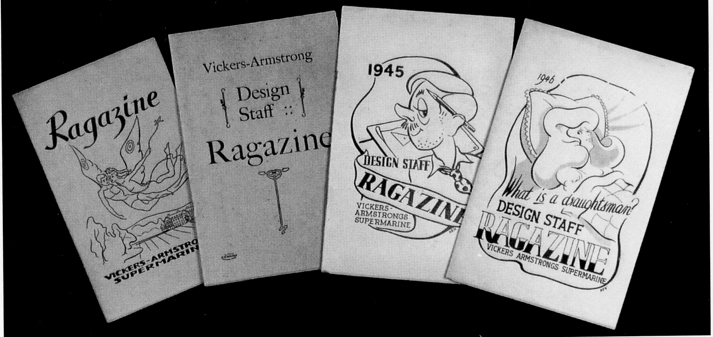

## Reminiscences, the Source of Legends

Did a Spitfire ever fly from Hursley Park?
Legend has it that one was assembled in the
experimental hangar and took off from the Park.
The only place this could possibly have been was
the site of the First World War aerodrome, on
the high ground above Pitt, not as some
assumed from the meadows south west of
Hursley School, but Jeffrey Quill the test pilot
considers this pure fantasy, as the chances of a
safe take—off from both sites would have been
reduced and the risk not justified, especially
with the school being so close. It is possible that
the story emanated from the fact that all
aircraft built at Hursley did a low fly—past for
the work-force, who were given time off outside
to view the spectacle. All new aircraft were
initially anchored to the ground at the back of
the hangar, for Rolls Royce engineers to run the
engines up to test that all was well, before they
were transported to an airfield. Small US.
Army aeroplanes, already mentioned, did take
off and land in the Park during the war years.
Small planes, and the very light, flimsy, ‘kites’ of
the First World War period could safely manage
in the confined and generally soft conditions, but
the Spitfire required a much longer and firmer
runway.

Vickers used aerodromes at Chilbolton, High
Post, near Salisbury, and Worthy Down for
testing. One day at High Post, the Americans
brought an aircraft there for testing, and the
secrecy surrounding it had to be seen to be
believed, with the aircraft completely covered
and surrounded by armed ‘Snowdrops’,
(military police in white helmets). The
Americans informed the bemused Vickers
staff that this aircraft would show what flying
was all about, and so with eager anticipation
everyone awaited the great day of its flight.
When the day came, many Vickers staff were
there to witness this epoch-making event in
the history of flight, and all were a little
unimpressed as the aircraft was a short,
thickset machine with a radial engine, and
was apparently manufactured by Grumman.
Snap rivets protruded all over the fuselage
and on the ground it was regarded as a
disappointment. The great moment came and
the machine took off. Unknown to the
Americans, so did Jeffrey Quill, Vickers Test
Pilot in a Spitfire. He ‘ran rings’ round the
Yankee machine, much to the delight of the
Vickers folk, and the chagrin of the Americans
who stopped talking to the Vickers staff.

There is, however, a punch line to this story,
as the Grumman aircraft was not there to
demonstrate its performance or
manoeuvrability, but to evaluate and test
certain equipment, a fact known only to a
selected few at Vickers. It was in fact the
Snowdrops who ‘laughed last’ behind their
batons, for having successfully acted out the
Charade!

One incident which is humorous now,
concerned the unofficial ‘cottage industry’
based in the experimental hangar making
cigarette lighters and, later, television tables.
To everyone’s astonishment, police officers
appeared on the scene to investigate. The
awful crime was not making the lighters, or
using valuable materials, but that no excise
duty had been paid on the completed smoking
accessory. So not for the first time, enterprise
was stifled by red-taped bureaucracy. Another
crime came to light one evening when the
night shift turned up, only to be told to report
direct to the canteen before starting work.
They were faced by the homburg-hatted Mr
Wakeling and plain-clothed policemen, who
told them that someone had stolen a bearing
race, and if that person ‘owned up’, it would be
better for him. No one said a word, so they
were told to stand by their benches, and a
search would be made of all tool boxes and
drawers. The first bench searched had the
offending bearing in the drawer (they had
obviously been searched earlier) and,
unfortunately for the culprit, two more were
found at his home in the garden well. The
bearings were not new, but salvaged from
damaged aircraft, and for this he received six
months in prison. What would be the penalty
today?

*‘Ragazine’ - Vickers Supermarine staff magazine*

Also remembered by these daytime visitors is
the welcome given by the villagers, whose
quiet lives must have been impacted,
although not so thoroughly disrupted as when
the American troops ‘came to town’ by the
hundreds. Then the Village seemed to be
awash with them from the camp around the
Merdon Castle part of the Park.

On the social front, there was a design staff
magazine called ‘Ragazine’ of which very few
seem to have survived. One of the highlights
of the Hursley design activities was the
annual design staff dinner organised by Bill
Cox, and assisted ably by the local comic,
George Wherley. Through canteen manager
Reg Turley’s skill, food and refreshments
were somehow obtained; the ways and means
of which should not be investigated too
closely. This event was supported by Joe
Smith and Wilf Elliott, who were more often
than not the butt of the memorable sketches
which followed the dinner. To their credit all
the sketches were received with good humour.

Looking back now fifty years on, all the
Vickers staff who have been contacted enjoyed
their stay at Hursley Park. The gardens were
a quiet place to watch and hear the birds
while eating a sandwich lunch, and after the
many air raids and alarms at Southampton it
was restful by contrast. Even though the bus
rides to town were exhausting, they are
remembered with humour, and are mentioned
in most reminiscences that have been shared.

The accompanying structure gives an
interesting look at the organisation during the
1940 to 1945 period. The photographs are
from material lodged in Cambridge University
Library, and reproduced with the kind
permission of Mr H E Scrope who was the
company photographer based at Vickers
House in London. The Hursley Photographer’s
name was Mr C D Burr, who was at Hursley
until the move to Swindon, when he retired.

