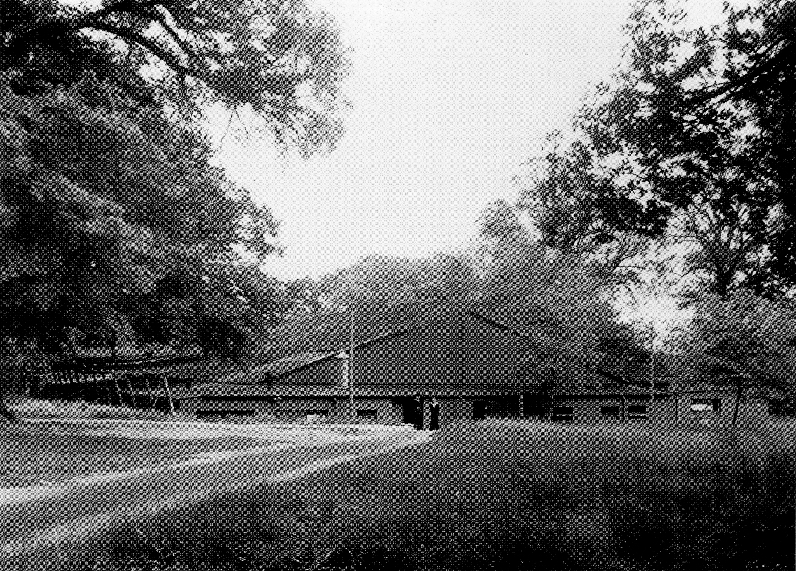
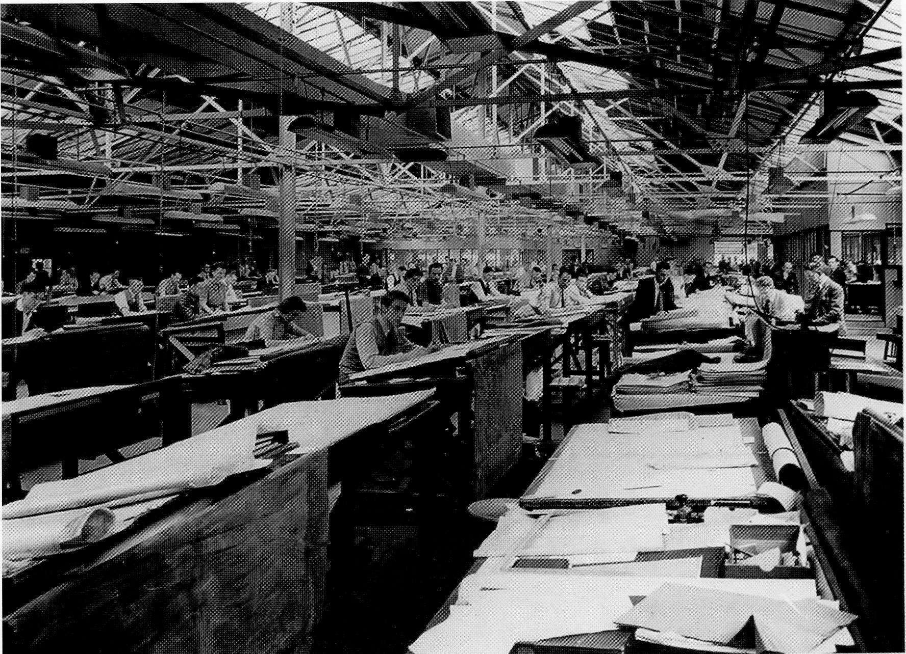
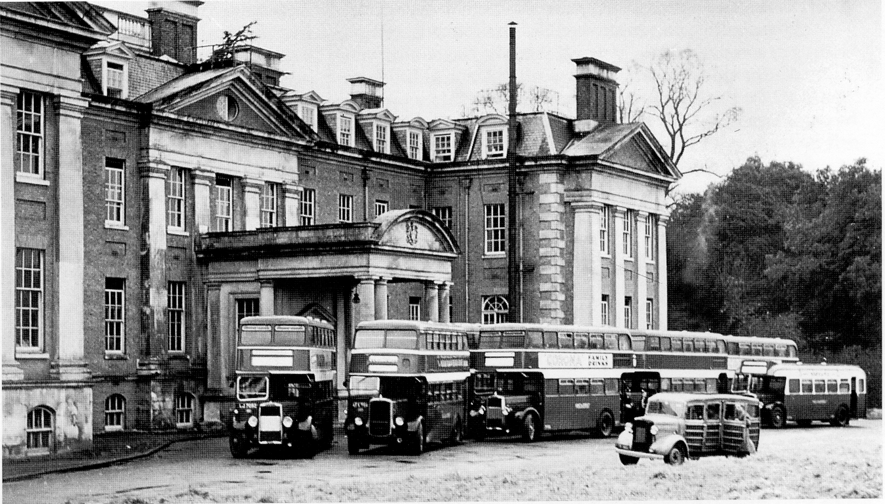
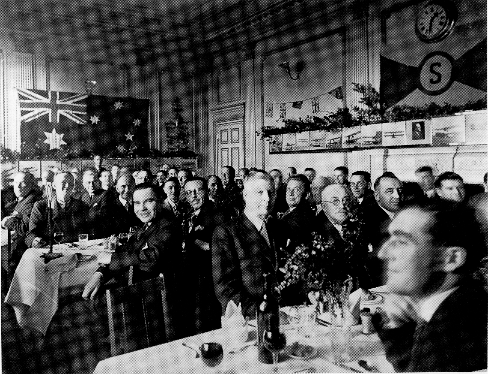
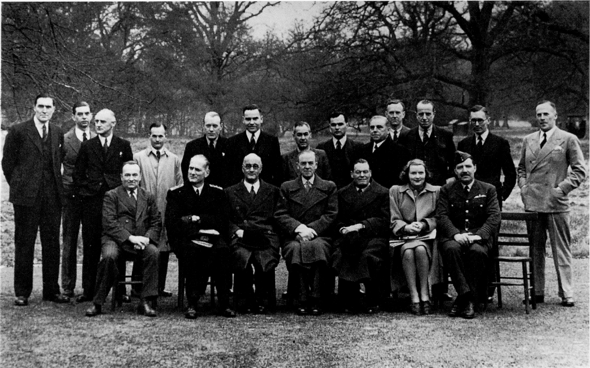
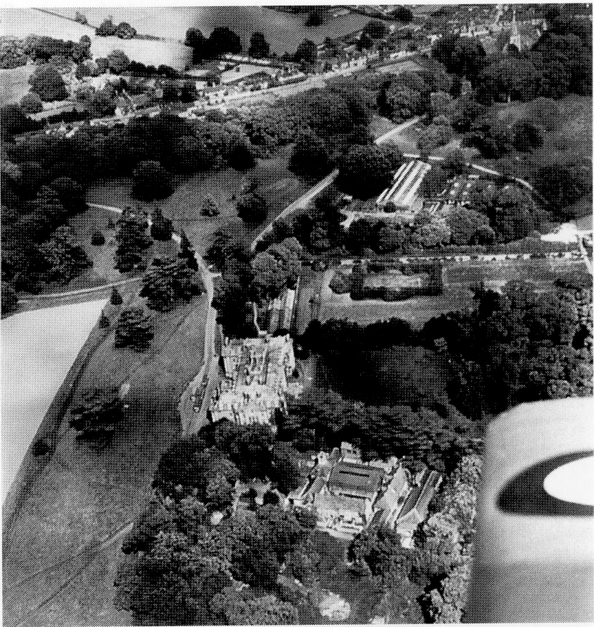
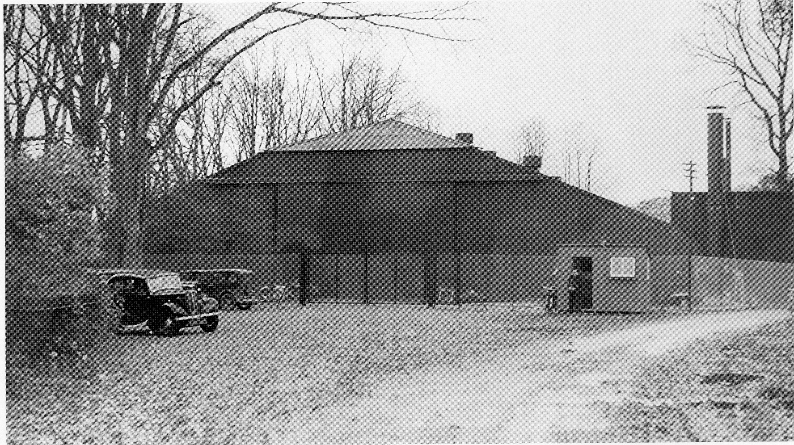
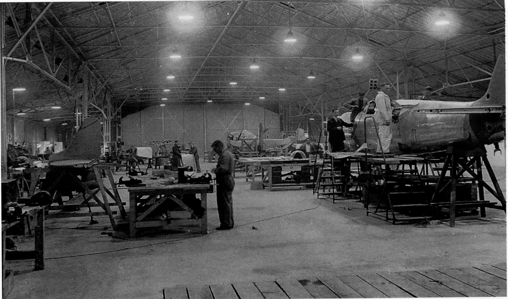
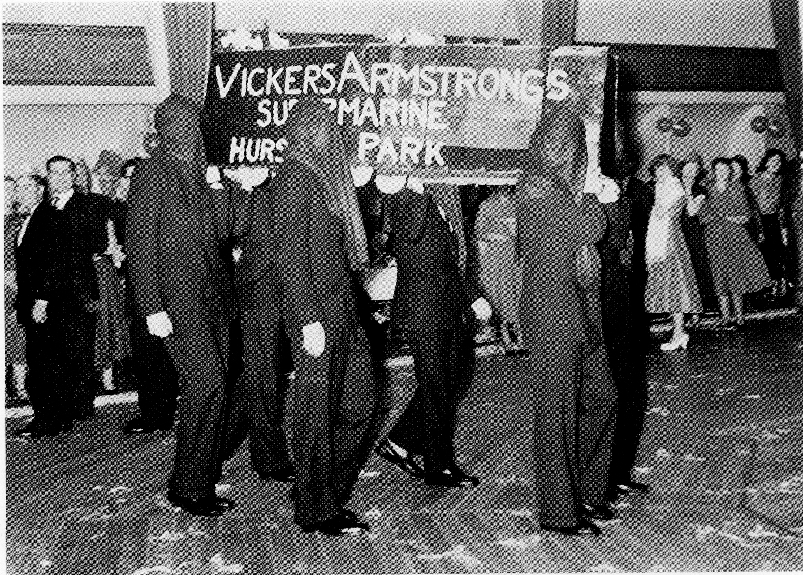

## A New Home for the Spitfire Design Team

As in the First World War, the now Dowager
Lady Cooper offered Hursley Park House for
use as a hospital, but this offer appears to
have coincided with a requisition placed on
the Park by Lord Beaverbrook, the then
Minister for Aircraft Production. After his
order to disperse Vickers operations was
made, he issued an edict for the immediate
requisition of the fourth floor of the Polygon
Hotel in Southampton to accommodate the
executives of the company. The design team
was housed at Southampton University until
they were again firebombed out of these
offices. In December 1940, they were all
moved to Hursley House, which formed a
suitable self-contained area for the
Supermarine administration.

Although a number of Lord Beaverbrook’s
personal staff moved down from London to
assist in the whole complex operation, which
spread over many counties (with
manufacturing and assembly of Spitfires
around Eastleigh, a new factory at Castle
Bromwich, and facilities at Newbury,
Reading, Salisbury, Southampton,
Trowbridge, Winchester, and the Westland
Aircraft factory at Yeovil), it was really Len
Gooch, then aged 30, and some able
administrators who were the driving force
behind the expansion and production of
Spitfires at that critical time. Lady Cooper, in
spite of having her offer countered by the
requisition order, and obviously feeling
overtaken by events and their overwhelming
impact on her stately home, with nearly all
control this time out of her hands, graciously
welcomed her new guests with a spectacular
floral model of the Spitfire in the entrance
hall of the House. The accommodation of the
design and administration staff required the
storage of most of the furnishings, paintings
and fabric that made up this country mansion.
For a time Lady Cooper continued to live on
the first and top floors of the House, and was
supported by a few staff. The staff were also
useful to Vickers until June 1942, when it
became impractical from a security standpoint
to continue with this arrangement, as the
following account shows.

On 19 June, several of the Supermarine staff
returned from a cricket match and were
surprised to discover fire engines in
attendance outside the House. It transpired
that Mr Grove the butler, being short staffed,
had taken on a casual assistant cook, who was
tempted by an opportunity to steal the family
silver stored in a safe in the basement. His
aim was to start a fire on the top floor above
Lady Cooper’s bedroom, to divert attention
away from the scene of his nefarious deed. His
plans went awry due to the substantial
reinforced concrete between the floors, and he
was somehow overcome by the smoke from his
own decoy fire. After investigation by the
Police, a bicycle went missing from the village
several days later, and the man was not seen
here again.

This incident highlighted the problem of
security, and Lady Cooper, together with her
staff, moved out to Merdon Manor Farm, little
knowing that she was ending two hundred
and twenty years of private residential use for
Hursley House. A former C.I.D. officer from
Scotland Yard, a Mr Wakeling, was taken on
as security officer, and is remembered for
always wearing a black suit and black
homburg hat which he was never known to
remove.

Evidently Scotland Yard considered their men
improperly dressed if the hat was removed.
This custom dated back many years and
helped cultivate the stereotype image of a,
Scotland Yard detective. For a time he lived in
one of the cottages that made up the bothy by
the stables, and had his office at the top of the
House. From this time Vickers Supermarine
completely occupied the House, stables and
cottages, and started the building of the two
large hangars. The one to the east of the
House was the drawing office, known later to
IBM as X Block (demolished in 1994) and the
other, adjacent to Southampton Lodge, was
the experimental hangar. (This was
demolished in 1986.)

*Drawing office from the north west. Photo: Cambridge University Library.*

Initially around fifty people came to Hursley,
soon to swell to several hundred as others
were recruited from all parts of the country
for their various skills and abilities suitable
for experimental factory work. A fairly large
group of printing operators were conscripted
from the Bournemouth area, as were workers
from the Midlands and North of England.
There were solicitors, professional footballers,
novelists, and retailers in this very mixed
bunch. The few with manufacturing
experience and skills in all—metal aircraft were
made chargehands or foremen to train and
educate the rest in the latest technology. The
hours at work were long — in excess of eighty
hours a week were often the case. If
individuals were persistently late or absent
from work, they would be hauled before a
tribunal to account for their behaviour, and
could be prosecuted and called up for service.
One young man served a month in Winchester
Prison, before being immediately conscripted
to the Air Force. A number of workers were
‘dereserved’ and Within days found themselves
in uniform. Some preferred this to factory life
to which they could not adapt.

*Drawing office interior. Photo: Cambridge University Library.*

Mr Wakeling is also remembered by some of
the senior executives for organising a trip to
London to sample some of the night life, of
which he seemed to have expert knowledge.
The unorthodox methods he used to gain
entrance to'some of the clubs were an eye
opener to those otherwise unblemished lives
who had never experienced such goings-on. He
also kept an eagle eye on those members of
the design staff who raided the walnut trees
in the Park, until some of the staff who were
working through the night found him
collecting walnuts in his famous homburg - an
incident he was not allowed to forget. The
design staff generally considered Wakeling to
be under employed, and invented cases for
him from time to time. One of his longest was
investigating the theft of Joe Smith’s
imaginary bicycle.

*Buses outside Hursley Park House. Photo: E B Morgan.*

Most of the Supermarine staff were bussed
into Hursley Park each morning and home
again in the evening. The bus rides are
remembered with measures of enjoyment and
trepidation. Some of the Supermarine folk
acted as conductors, and each bus had its
card—playing contingent on the top deck. In
the early days, Hursley Coaches, owned by the
Jones family, had the contract to bus in
Vickers staff, and one of the Jones brothers is
remembered for taking his hands off the
steering wheel to unwrap a sweet slowly and
methodically before putting it in his mouth.

Later, staff numbers increased and local bus
companies had to be brought in to assist with
the extra numbers. The drivers, used to more
normal stop and go routines to match the bus
stops, had to adjust to a 16 mile non-stop trip.
There were often two buses running neck and
neck up the Chandler’s Ford Road to try to get
to the ‘S’ bend first. By contrast, there were
foggy nights when two passengers walked in
front to lead the bus along the Woolston to
Netley portion, making that a long, tedious
trip. One evening a design staff member fell
asleep in the washroom, missed his bus to
Eastleigh, and had to, wait until midnight
before a Supermarine driver was able to give
him a lift home. Only the most senior staff
had the privilege of motor cars, with the
essential petrol coupons to run them.

*Executive staff Christmas lunch. Photo: C R Russell.*

Reg Turley, the canteen manager, had been
recruited from Lowman’s the Bakers in
Southampton. He was in charge of the
provision of daily lunch requirements. There
were two lunch sittings and two dining rooms.
The principal dining room was reserved for
senior members of staff. There the difference
was more evident in the decor and aperitifs
than in the food. This two-level system was
the norm in British Industry at the time.

Between the years of 1940 and 1957 the
rooms of the House were used for many
purposes, and here is a brief description of
some of their various functions and uses
starting with the lower ground floor:

The original wine stores provided cool, dark
facilities for the photographic department,
before their eventual move into the stable 10ft,
headed by a Mr Burr.

Successful communications were essential to
the Supermarine management and the
telephone exchange was a vital link between
the dispersal units. They also provided a
direct line to the R.A.F. so that a member of
the Observation Corps here could monitor the
movement of enemy aircraft.

Mrs Edwards was Lady Cooper’s cook, and
several of the Supermarine staff, when
required to work all night to solve urgent
problems, were thankful for the constant
supply of her renowned ‘stock pot’. Another
revered cook was Mrs Cocket, who prepared
supper for the handful of design staff on fire-
watch duty every night. She could work
miracles with a potato, a bit of cheese and
some dried egg.

The metallurgical laboratory was initially
housed in the former linen store where the
numerous cupboards provided storage for
their many chemicals.

On the ground floor the rooms were used as
follows:

The library contained a wealth of books and
was kept locked for the period that Lady
Cooper lived on in the House. Later, this room
was taken over by the technical library which
provided the Supermarine staff with a most
valuable service when they were involved in
recording alterations and improvements to the
wartime aircraft.

The ballroom and winter garden (conservatory)
were the original quarters for the design staff,
but as this team expanded it was necessary to
build additional accommodation in the Park.
By the end of 1941 a purpose-built drawing
office (X Block until 1994) together with five
prefabricated huts were erected to the east of
the House, affording easy access to the
executive staff via the conservatory. The first
hut was used by the electrical design team,
the second one was home for the technical
publications department under Gerry Gingell.

The flying boats design team under the
direction of Harry Phillips was housed in the
third hut, which was next to the layout and
model shop after they had moved across from
the stable loft. The end hut was used by the
hydraulics design section. Approximately 25
to 30 staff were accommodated in each hut.
The huts are remembered for being
excessively cold in winter and hot in summer.

*Vickers senior staff group, with Sir Stafford Cripps (seated third from left, front row).*

Joe Smith, the chief designer and natural
successor to the designer of the Spitfire, R J
Mitchell, had his office in the former business
room, with a view across the sweeping lawns
to the south. He was a man respected from
the shop floor upwards, and although he
would never claim Mitchell’s genius, he was
without doubt the right man to head the
Spitfire’s development.

The executive dining room differed from the
mess rooms, and in addition to their staff
lunch they were provided with a bottle of beer.
The then Duke of Kent was one distinguished
visitor to be entertained here shortly before
his death on 25 August 1942. For his visit, the
maintenance department tried to spruce up
the surroundings, but discovered each piece of
restoration required considerably more time
and effort than first envisaged. (The present
Duke of Edinburgh visited Hursley Park on
Friday 17 April 1953, accompanied by the 17
year old Duke of Kent. They toured Chilbolton
where they witnessed a demonstration of the
Supermarine Swift, piloted by Dave Morgan,
and after visiting Hursley Park design offices
and the Experimental Hangar, ended the tour
at the South Marston Works. Sir Stafford
Cripps also got the VIP treatment when he
visited Hursley Park, with everything being
made smart and tidy for the occasion.)

After Lady Cooper vacated the House, her
suite of rooms on the first floor was occupied
by the Commercial Manager, the Production
Manager, Personnel Manager and their
secretaries. The former William and Mary
bedroom was allocated to Commander Bird,
the general manager, and the office of
overseer was occupied by Group Captains
Perkins and Thompson at different times in
the Cromwell Dressing Room. Other rooms,
including the Chinese Bedroom and the
Azalea Bedroom were used to accommodate
the Shipping Office and the Technical
Publications Department. Unfortunately,
during some maintenance and refurbishment
work the wallpaper in the Chinese Bedroom
Was thought to look shabby, and was
consequently given a coat of paint. The
maintenance staff had not realised that it was
silk.

One resident Technical Officer, Kenneth
Knell, who was also a pilot, and his assistant
Stuart Mosey established a reputation for
opening many doors to establish important
business contacts and overcome obstacles, a
gift shared by Arnold Hall, who later became
Sir Arnold Hall and Chairman of Hawker
Siddeley Aviation. Stuart Mosey also went to
Hawker Siddeley at Hamble but as Resident
Technical Officer.

*Aerial photo of site.
Photo: Cambridge University Library.*

In a bid never to be caught again with drawings
so easily destroyed by fire, the garages and coal
store were re-roofed in massive reinforced
concrete to Withstand incendiary bombs, and
this provided a secure drawing and document
archive as well as some offices.

The stable block provided very useful
accommodation and a Belman hangar was
constructed in the courtyard to house
facilities, including hydraulics for
experimental work there. In one corner was
an inspection pit with a gimbal arrangement
above to enable the testing of fuel system flow
rates encountered at certain altitudes and
tilts.

The metallurgists had a test building where
they could inspect materials daily for changes
in appearance brought about by stress and
corrosion. This building stood approximately
where the present radio frequency
interference facility is to the south west of the
House. This building was simply a low
corrugated steel roof supported on an angle-
iron frame, with no sides. The chemical,
metallurgical laboratory and photographic
department were moved to the ground floor of
the stables when they were vacated by the
model shop. Subsequently the photographic
activity was moved into the loft to make room
for a test facility covering hydraulic, electrical
and fuel systems which was later expanded to
take in part of the Belman hangar where the
gimbal pit was provided. The area between
the hangar and the stable block was roofed
over to house a high-altitude test chamber
with its associated pumps.

*Experimental hangar from the east. Photo: Cambridge University Library.*

The entertainment hall that once stood
behind the stables on the south side was used
as a machine shop. It seems that oil from the
machines soaked in and ruined the floor and
vibration made the walls unstable. For the
once immaculate hall, this was a sad end to a
dance floor which was considered to be the
best for some twenty miles around. After
Vickers’ tenure it was in such a poor state
that it was demolished for safety.

Like the drawing office, the experimental
hangar was rapidly constructed under a line
of large trees close to the Southampton Lodge
entrance in 1942, and enabled the _
experimental shops to be moved there from
their makeshift accommodation in the stable
block. This building expanded, with several
extensions for a canteen and other facilities.
This whole area enabled full sized prototypes
and aircraft to be worked on with
unaccustomed comfort. One characteristic of
working here was the effect spilt hydraulic
fluid had on crepe-soled shoes, much in vogue
at the time, as it caused the sole to expand to
almost double the footprint.

*Experimental hangar interior. Photo: Cambridge University Library.*

The building to the east of the House was the
drawing office, a use that continued for a
while with the new tenants (IBM) from 1958,
and was still remembered by those with more
than twenty years of service with IBM in
1990\. There was a hangar-type building near
or where the present RFI laboratory stands.
This was used as a mock-up shop for the
Attacker aircraft. By necessity, the
administration spilled over into the village,
and other Cooper properties were taken over.
Southend House, for example, acquired some
prefabricated huts in the grounds, to
accommodate the whole accounts section in
quite an efficient operation, although the way
the wage packets were carried through the
Village to the House and experimental hangar,
would today cause even the mildly security
conscious to break out in a cold sweat! As
aircraft production receded in the post-war
period, the Vickers organisation began to
discuss plans to relocate their personnel to
South Marston, near Swindon, Wiltshire, a
move which Joe Smith and others strongly
resisted, and it was only after his death on 20

February 1956 that Vickers finally undertook
the controversial move from Hursley. A
number of people did not relish moving to
Swindon and left the firm, others tried the
move but did not like it and left. The
accompanying photograph of hooded pall—
bearers carrying the coffin of ‘Vickers
Armstrongs Supermarine Hursley Park’, at a
company social function of the time, eloquently
sums up the feelings of the Hursley staff.

*Pall bearers making a point. (The Pier Ballroom, Southampton). Photo: C R Russell.*