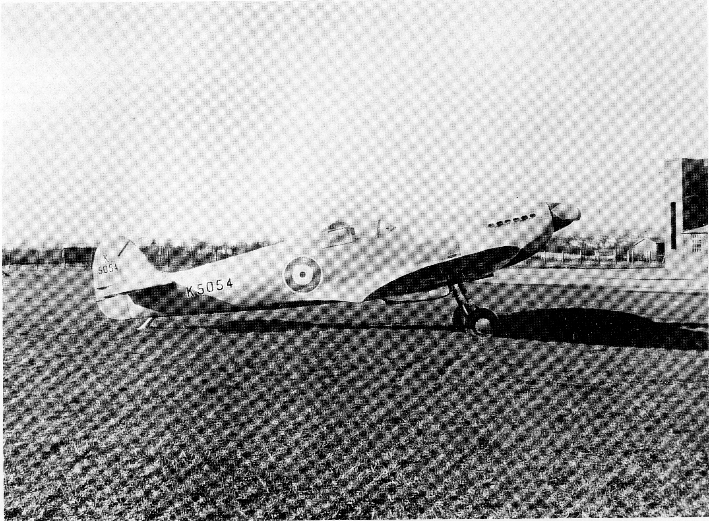
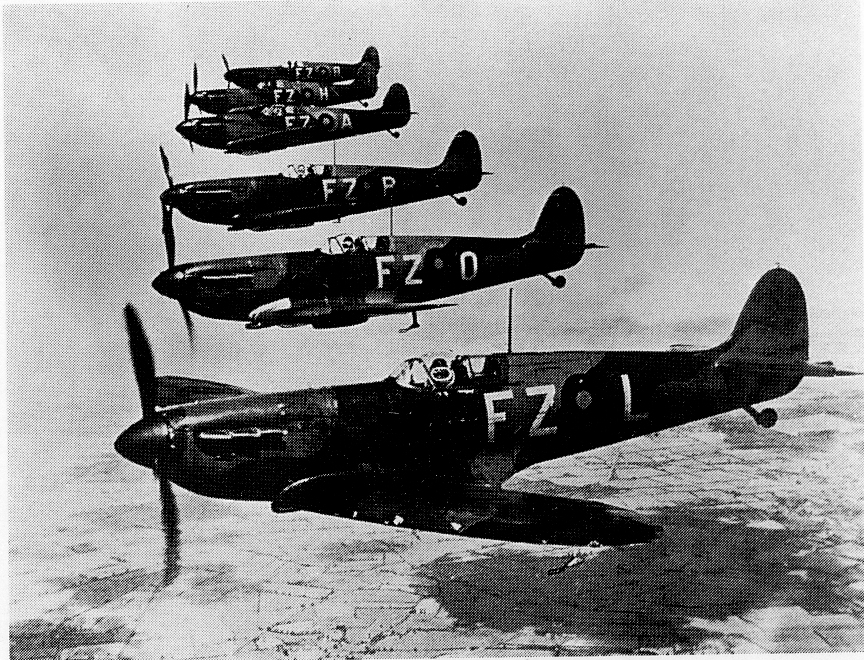
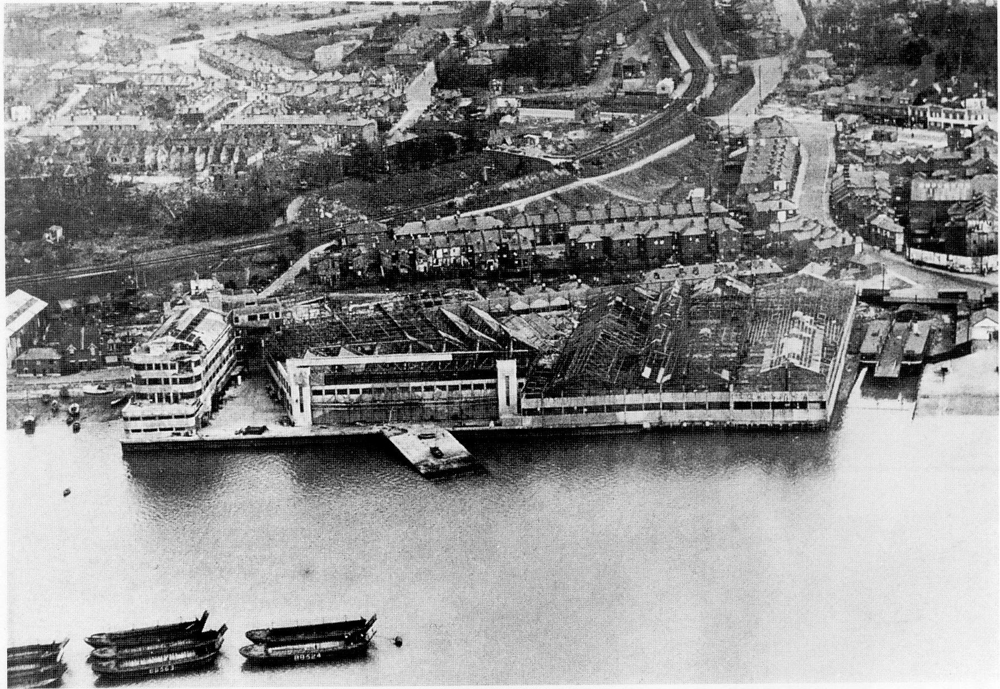
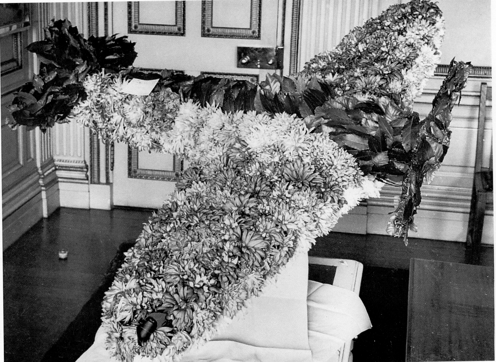

## Vickers Supermarine

In 1913, Noel Pemberton Billing used the
name Supermarine as his telegraphic
address, when he started making ‘boats that
will fly, and not just aeroplanes with floats’.
His aim was to build the antithesis of the
submarine, under his own name Pemberton
Billing. However, the First World War was
the catalyst to him building a single—seater
fighter plane. In 1916, the newly appointed
managing director Hubert Scott—Pain
renamed the company ‘The Supermarine
Aviation Works Limited’ and the factory
beside the River Itchen at Woolston
developed. After the war, Supermarine
focused on flying boats, which were gaining in
popularity and use, as water provided a most
suitable medium for takeoffs and landings. In
1928 the firm was acquired by Vickers
Aviation Limited and linked Supermarine
with the extensive Vickers group of
companies. In 1929 the collaboration with
Rolls Royce to develop the Schneider Trophy
aircraft S6, and in 1931 the S6B, which won
the trophy outright, led directly to the
development of the Spitfire and its series of
Rolls Royce engines.

*Prototype Spitfire. Photo: E B Morgan.*

Wednesday 5 March 1986 marked the 50th
anniversary of the first flight of the famous
Spitfire from Atlantic Park, now
Southampton Airport at Eastleigh. Mutt
Summers was the test pilot (who was flown to
Eastleigh by another later famous test pilot
Jeffrey Quill) for the maiden test flight of the
Spitfire. For this Summers used a special fine
pitch propeller to ensure a safe take—off by
minimising swing caused by propeller torque
on take-off. This was expected because the
aeroplane was far below its maximum take-
off weight. Coincidental with the 1986
anniversary was the demolition of the hangar
buildings (near Southampton Lodge), which
were erected by Vickers Supermarine for the
development of the Spitfire at Hursley in
1942\. These are some of the vignettes of this
critical period of England’s history as it
affected Hursley Park, provided by some of
the limited material that has survived.

The Spitfire was a phenomenal aircraft whose
design was conceived by R J Mitchell. Its
considerable virtues were largely due to its
low very thin wing section and very strong
airframe. The prototype of 1936 weighed
approximately 2 tons. Development to later
Marks took the weight to over 5 tons, with
increased armaments, fuel tanks and larger
engine. Later marks could achieve a
horizontal speed of 620mph (997kph) — 0.9
Mach, out of a power dive, a figure that later
more sophisticated jet aircraft could not
match, although they had an advantage in
rate of climb and flight speed without the
power dive. The Battle of Britain was won by
the role the Spitfire could play in high altitude
combat, while at lower altitudes the work-
horse of R.A.F. Fighter Command, the
Hawker Hurricane, complemented the high-
flying ‘Spit’.

   

Mark I Spitfires in formation
 

The important and historic relationship of the
legendary Spitfire and Hursley Park is really
the product of ‘necessity being the mother of
improvisation’ with some considerable instant
inventiveness thrown in. An intensive raid on
Southampton by Messerschmitt 110 planes on
24 September 1940 and another two days
later by 59 Heinkel bombers, escorted by 70
Messerschmitt 110s were centred on the
Vickers Supermarine headquarters at
Woolston. The raid was so effective that
production of Spitfires was temporarily
halted. Although the factory could have been
made operational again, it was too well known
to the enemy and too small, so dispersal was
more than practical. However, one blessing
was that the bombs did not destroy the
machine tools or the finished parts store. In
the new office building at Woolston the Chief
Draughtsman’s office was on the top floor
directly above that of the Chief Designer.
After the air—raid a couple of the design staff
were cleaning up the paper work which, with
everything else, was strewn all over the floor.

*Vickers factory at Woolston after the bombing. Photo: E B Morgan.*

After about 45 minutes when the mess had
been cleared, it was apparent that a lot of
drawings had concealed a large hole in the
floor through which a bomb had gone into the
office below, before passing through a wall.
That neither of the two design staff fell
through the hole was something of a miracle.
However, the mock-up of a very promising
four—engine bomber, which was also being
designed by Supermarine, was completely
destroyed, and the design was abandoned.

After Lord Beaverbrook (Minister for Aircraft
Production) had surveyed the scene and made
his dispersal decision, responsibility for the
Southampton area fell to Mr L G Gooch, Works
Engineer. He and his office quickly grasped the
situation and seized the opportunity, such that
within days Spitfire production started to pick-
up again. Ultimately Len Gooch became Area
Manager’s Co-ordinator. The timing and
effectiveness of the raid meant that plans had to
be devised and adapted quickly for 100 percent
dispersal. It soon transpired that, prior to the
outbreak of the war, the German sea—plane
pilots who regularly called at Woolston to clear
Customs, became too knowledgeable about the
layout, contents, and importance of the
Supermarine works. The pilots brought mail
from America in the fastest possible time having
been catapulted from the liner ‘Bremen’ and her
sister ship the ‘Europa’ off the coast of Ireland
near Shannon. It was realised that the circular
approach flight around the town was no doubt
used to photograph the area, and that the flight
of a Dornier DOX over Southampton and
Portsmouth prior to the air-raids was no
coincidence.

*Floral Spitfire*

